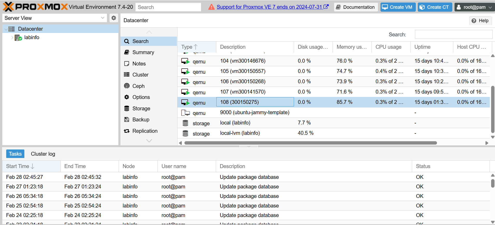

---

## 4. Preuve de création de la machine virtuelle

### 4.1 Informations de la VM

- **Nom de la VM :** vm300150275  
- **Créée avec :** OpenTofu  
- **Plateforme :** Proxmox VE  
- **Cours :** INF1102  

### 4.2 Description

La machine virtuelle `vm300150275` a été déployée automatiquement à l’aide d’OpenTofu via le provider Proxmox.  
Le déploiement a été effectué après l’exécution des commandes :

- `tofu init`
- `tofu plan`
- `tofu apply`

La VM a été créée avec succès et est accessible sur le réseau interne du laboratoire.

### 4.3 Capture d’écran de validation

La capture d’écran ci-dessous démontre :

- La présence de la VM dans l’interface Proxmox  
- L’état actif (running) de la machine  
- L’accès au terminal Ubuntu  
- La configuration réseau appliquée  

---
