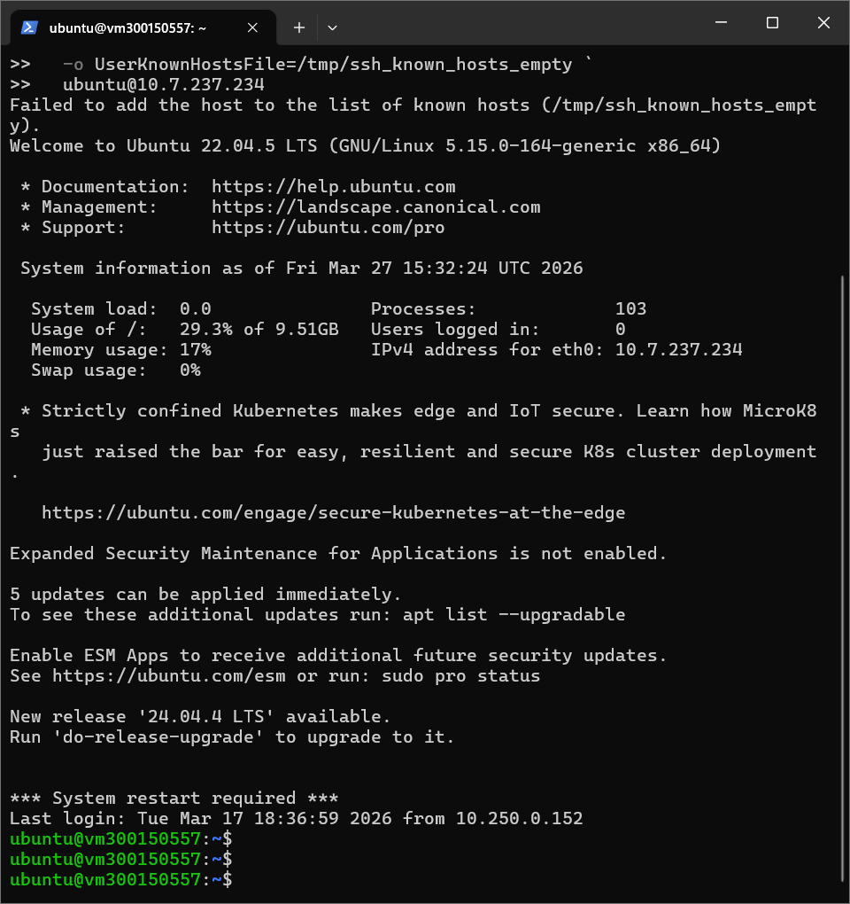

\# VM Proxmox créée avec OpenTofu pour le cours INF1102


\---


\## 1. Commandes utilisées


```powershell

tofu init

tofu plan

tofu apply

```


\---


\## 2. Résumé de l'état OpenTofu


```json

{

&#x20; "type": "proxmox\_vm\_qemu",

&#x20; "name": "vm300150557",

&#x20; "ipconfig0": "ip=10.7.237.234/23,gw=10.7.237.1"

}

```


Cet extrait JSON montre que la VM \*\*vm300150557\*\* a bien été créée sur Proxmox avec l'adresse IP \*\*10.7.237.234/23\*\* et la passerelle \*\*10.7.237.1\*\*.


\---


\## 3. Contenu des fichiers de configuration


\### `main.tf`


```hcl

resource "proxmox\_vm\_qemu" "vm1" {

&#x20; name        = var.pm\_vm\_name

&#x20; target\_node = "labinfo"

&#x20; clone       = "ubuntu-jammy-template"

&#x20; full\_clone  = false

&#x20; cores   = 2

&#x20; sockets = 1

&#x20; memory  = 2048

&#x20; scsihw = "virtio-scsi-pci"


&#x20; disk {

&#x20;   size    = "10G"

&#x20;   type    = "scsi"

&#x20;   storage = "local-lvm"

&#x20; }


&#x20; network {

&#x20;   model  = "virtio"

&#x20;   bridge = "vmbr0"

&#x20; }


&#x20; os\_type    = "cloud-init"

&#x20; ipconfig0  = var.pm\_ipconfig0

&#x20; nameserver = var.pm\_nameserver

&#x20; ciuser     = "ubuntu"


&#x20; sshkeys = <<EOF

&#x20;  ${file("\~/.ssh/ma\_cle.pub")}

&#x20;  ${file("\~/.ssh/cle\_publique\_du\_prof.pub")}

&#x20; EOF

}

```


\### `provider.tf`


```hcl

terraform {

&#x20; required\_providers {

&#x20;   proxmox = {

&#x20;     source  = "telmate/proxmox"

&#x20;     version = ">= 2.9.0"

&#x20;   }

&#x20; }

}


provider "proxmox" {

&#x20; pm\_api\_url          = var.pm\_url

&#x20; pm\_api\_token\_id     = var.pm\_token\_id

&#x20; pm\_api\_token\_secret = var.pm\_token\_secret

&#x20; pm\_tls\_insecure     = true

}

```


\### `variables.tf`


```hcl

variable "pm\_vm\_name" {

&#x20; type = string

}


variable "pm\_ipconfig0" {

&#x20; type = string

}


variable "pm\_nameserver" {

&#x20; type = string

}


variable "pm\_url" {

&#x20; type = string

}


variable "pm\_token\_id" {

&#x20; type = string

}


variable "pm\_token\_secret" {

&#x20; type      = string

&#x20; sensitive = true

}

```


\### `terraform.tfvars`


```hcl

pm\_vm\_name      = "vm300150557"

pm\_ipconfig0    = "ip=10.7.237.234/23,gw=10.7.237.1"

pm\_nameserver   = "10.7.237.3"

pm\_url          = "https://10.7.237.19:8006/api2/json"

pm\_token\_id     = "tofu@pve!opentofu"

pm\_token\_secret = "f2097a3c-f9f0-4558-9a43-5cd0ae718abe"

```


\---


\## 4. Capture d'écran de la VM


\### Capture d'écran de ma VM vm300150557


Cette image est la capture de l'accès à ma machine virtuelle \*\*vm300150557\*\* créée automatiquement avec OpenTofu sur Proxmox.





\---


\*Travail réalisé par \*\*Hani Aghilas Damouche\*\* — Numéro d'étudiant : \*\*300150557\*\*\*


