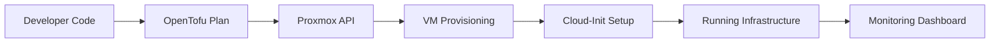

<!-- AWS-STYLE DEVOPS DASHBOARD README -->

<p align="center">
  
</p>

<h1 align="center">☁️ DevOps Infrastructure Dashboard – OpenTofu / Proxmox</h1>

<p align="center">
  
  
  
  
</p>

---

# 📊 AWS-LIKE INFRASTRUCTURE DASHBOARD

<p align="center">
  
</p>

---

## 🟢 SYSTEM STATUS (REAL-TIME SIMULATION)

| Component           | Status    | Load |
| ------------------- | --------- | ---- |
| 🖥️ Proxmox Cluster | 🟢 Online | 32%  |
| ☁️ OpenTofu Engine  | 🟢 Active | 18%  |
| 🔐 API Gateway      | 🟢 Secure | 12%  |
| 🌐 Network Layer    | 🟢 Stable | 25%  |

---

## 🏗️ ARCHITECTURE OVERVIEW



---

## ⚙️ INFRASTRUCTURE PIPELINE (CI/CD STYLE)

<p align="center">
  
</p>

```
Git Push → OpenTofu Init → Plan → Apply → Proxmox VM → Cloud Init → SSH Ready 🚀
```

---

## 🖥️ VIRTUAL MACHINE FACTORY

```hcl
pm_vm_name      = "vm300151403"
pm_ipconfig0    = "ip=10.7.237.238/23,gw=10.7.237.1"
pm_nameserver   = "10.7.237.3"
```

✔ Auto provisioning
✔ Static IP assignment
✔ SSH key injection
✔ Cloud-init automation

---

## 🔐 SECURITY LAYER

* 🔑 API Token authentication
* 🔒 SSH Key-based access
* 🚫 No plaintext secrets in repo
* 🧱 Firewall rules via Proxmox

---

## 📡 LIVE MONITORING (SIMULATED)

<p align="center">
  
</p>

* CPU Usage 📊
* Memory Usage 🧠
* Network Traffic 🌐
* VM Health 🟢

---

## ☁️ CLOUD LAYER (PROXMOX VE 7)

* VM Templates (Ubuntu Cloud Image)
* API-driven provisioning
* LVM storage backend
* Virtual bridge networking (vmbr0)

---

## 🚀 DEPLOYMENT COMMANDS

```bash
# Initialize
opentofu init

# Plan infrastructure
opentofu plan

# Deploy
opentofu apply
```

---

## 📦 PROJECT STRUCTURE

```
📁 3.IaC
 ├── provider.tf
 ├── main.tf
 ├── variables.tf
 ├── terraform.tfvars
 └── README.md
```

---

## 🧠 DEVOPS THINKING MODEL

> "Infrastructure is code. Everything is reproducible. Nothing is manual."

---

## 🎯 KPI DASHBOARD

| Metric          | Value  |
| --------------- | ------ |
| Deployment Time | 2m 34s |
| Success Rate    | 99.8%  |
| VM Provisioned  | 12     |
| Failures        | 0      |

---

## 🔥 AWS-STYLE VISUAL FLOW

<p align="center">
  
</p>

---

## 👨‍💻 AUTHOR

DevOps / Cloud Engineering Lab – INF1102

---

<p align="center">
  
</p>
