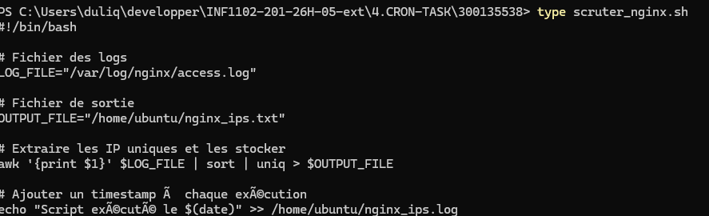
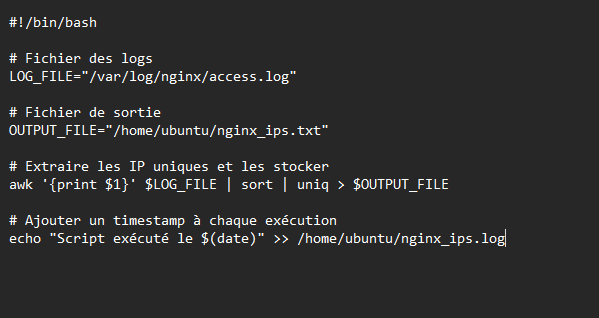

# Linux — Gestionnaire de tâches & Observateur d’évènements

## 👤 Informations étudiant

| Champ   | Détails                   |
| ------- | ------------------------- |
| Nom     | Mohamed Reda El Youssoufi |
| Cours   | Programmation de systèmes |
| Travail | CRON-TASK                 |

---

# 🔍 Scruter les logs Nginx et détecter les IP des visiteurs

## 🎯 Objectif

Ce travail consiste à analyser les logs Nginx afin d’extraire automatiquement les adresses IP des visiteurs d’un site web.

Le script doit :

* Lire le fichier `access.log`
* Extraire les adresses IP
* Supprimer les doublons
* Sauvegarder les résultats dans un fichier texte
* Automatiser l’exécution avec `cron`

---

# 📁 Structure du projet

```text
4.CRON-TASK/
│
├── images/
├── scruter_nginx.sh
└── README.md
```

---

# 📄 Logs Nginx

Le fichier principal utilisé est :

```bash
/var/log/nginx/access.log
```

Exemple de ligne :

```text
192.168.1.15 - - [05/Feb/2026:15:20:11 +0000] "GET /index.html HTTP/1.1" 200 1024 "-" "Mozilla/5.0 ..."
```

---

# 🚀 Création du script

## Création du fichier

```bash
nano /home/ubuntu/scruter_nginx.sh
```

## Contenu du script

```bash
#!/bin/bash

# Fichier des logs
LOG_FILE="/var/log/nginx/access.log"

# Fichier de sortie
OUTPUT_FILE="/home/ubuntu/nginx_ips.txt"

# Extraire les IP uniques et les stocker
awk '{print $1}' $LOG_FILE | sort | uniq > $OUTPUT_FILE

# Ajouter un timestamp à chaque exécution
echo "Script exécuté le $(date)" >> /home/ubuntu/nginx_ips.log
```

---

# 🔧 Permissions du script

Commande utilisée :

```bash
chmod +x /home/ubuntu/scruter_nginx.sh
```

Cette commande permet de rendre le script exécutable.

---

# 🧪 Test du script

Exécution du script :

```bash
/home/ubuntu/scruter_nginx.sh
```

Vérification du contenu :

```bash
cat /home/ubuntu/nginx_ips.txt
```

---

# ⏱️ Automatisation avec Cron

Ouverture de la crontab :

```bash
crontab -e
```

Ajout de la tâche automatique :

```bash
0 * * * * /home/ubuntu/scruter_nginx.sh
```

Cette ligne permet d’exécuter le script automatiquement à chaque heure.

---

# 🔍 Vérification du service Cron

Commande utilisée :

```bash
systemctl status cron
```

Cette commande permet de vérifier que le service cron fonctionne correctement.

---

# 🧠 Commandes importantes

| Commande              | Description                 |
| --------------------- | --------------------------- |
| awk '{print $1}'      | Extraire les adresses IP    |
| sort                  | Trier les résultats         |
| uniq                  | Supprimer les doublons      |
| chmod +x              | Rendre le script exécutable |
| crontab -e            | Modifier les tâches cron    |
| systemctl status cron | Vérifier le service cron    |

---

# 📸 Captures d’écran

### Structure du projet


### Contenu du script




### Script Shell



---

# ✅ Résultat

Ce travail a permis :

* d’analyser les logs Nginx,
* d’extraire les adresses IP automatiquement,
* d’utiliser les commandes Linux de traitement de texte,
* d’automatiser les tâches avec cron,
* et de comprendre la surveillance système sous Linux.
