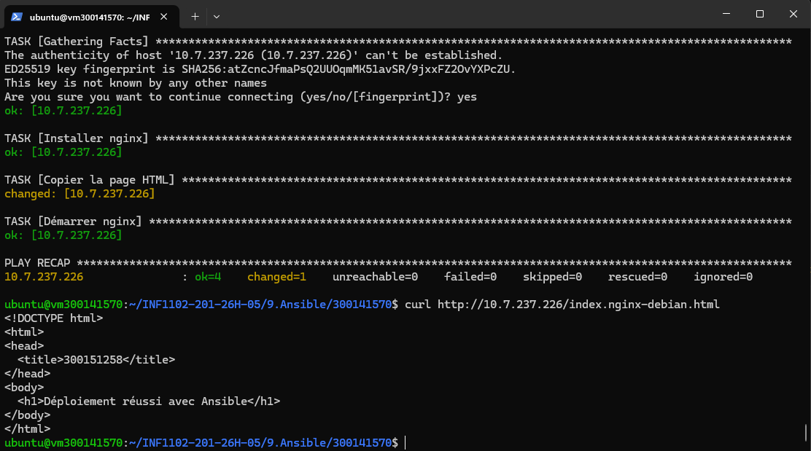

# 🟢 TP CRON – Analyse des logs Nginx

## 🎯 Objectif
Créer un script permettant :
- Extraire les adresses IP des visiteurs depuis les logs nginx
- Supprimer les doublons
- Sauvegarder les résultats dans un fichier
- Automatiser l’exécution avec CRON

---

## 📁 Structure du projet


300141570/
├── scruter_nginx.sh
└── images/
└── 1.png


---

## 📜 Script utilisé

```bash
#!/bin/bash

LOG_FILE="/var/log/nginx/access.log"
OUTPUT_FILE="/home/ubuntu/nginx_ips.txt"

awk '{print $1}' $LOG_FILE | sort | uniq > $OUTPUT_FILE
echo "Script exécuté le $(date)" >> /home/ubuntu/nginx_ips.log
⚙️ Explication
awk '{print $1}' : extrait la première colonne (adresse IP)
sort : trie les IP
uniq : supprime les doublons
> : redirige vers un fichier
echo : ajoute un log avec la date d’exécution

Ce fonctionnement correspond exactement à l’objectif du TP : extraire et stocker les IP uniques des visiteurs nginx.

▶️ Exécution du script
chmod +x scruter_nginx.sh
./scruter_nginx.sh
⏰ Automatisation avec CRON
crontab -e

Ajouter :

0 * * * * /home/ubuntu/scruter_nginx.sh

✔ Le script s’exécute automatiquement chaque heure.

📸 Capture

🧠 Résultat attendu
Fichier nginx_ips.txt contenant les IP uniques
Fichier nginx_ips.log contenant les dates d’exécution
🚀 Conclusion

Ce TP permet de comprendre :

L’analyse des logs système
L’utilisation de commandes Linux (awk, sort, uniq)
L’automatisation avec CRON pour exécuter des tâches périodiques

---

```



