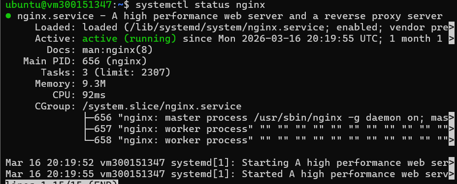
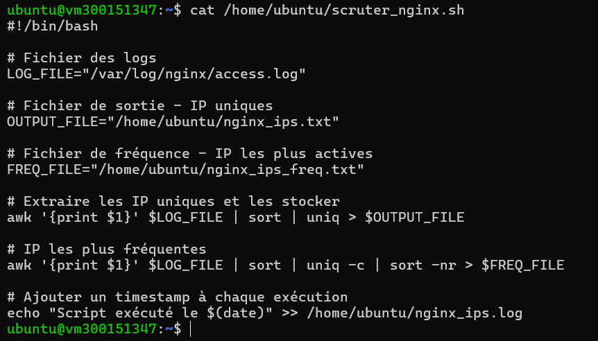
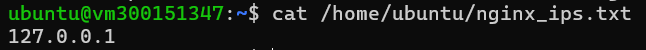
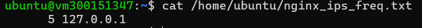
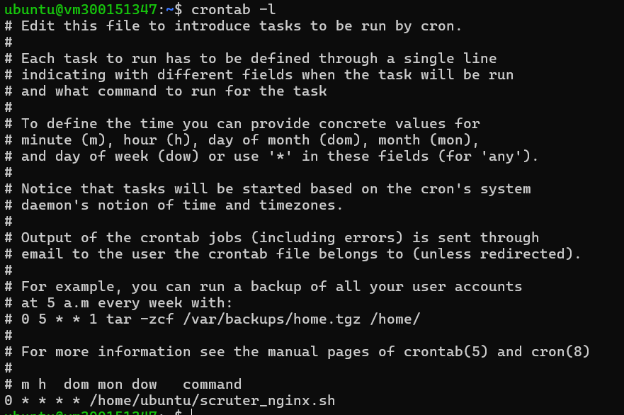

SARAHOCINE
# 👁️ Big Brother — Surveillance des logs Nginx

## 🎯 Objectif
Surveiller les adresses IP qui visitent le serveur Nginx,
stocker les résultats et automatiser la tâche avec CRON.

---

## 1️⃣ Nginx actif



---

## 2️⃣ Script `scruter_nginx.sh`



### Ce que fait le script :
- Lit le fichier `/var/log/nginx/access.log`
- Extrait la première colonne (adresse IP)
- Supprime les doublons avec `sort | uniq`
- Sauvegarde les IP uniques dans `nginx_ips.txt`
- Classe les IP par fréquence dans `nginx_ips_freq.txt`
- Enregistre un timestamp dans `nginx_ips.log`

---

## 3️⃣ IP extraites



---

## 4️⃣ IP par fréquence



---

## 5️⃣ CRON configuré



### Ligne ajoutée :
\```
0 * * * * /home/ubuntu/scruter_nginx.sh
\```

---

## 🔧 Commandes clés

| Commande | Description |
|---|---|
| `awk '{print $1}' access.log` | Extraire les IP |
| `sort \| uniq` | Trier et supprimer les doublons |
| `uniq -c` | Compter les occurrences |
| `sort -nr` | Trier par fréquence décroissante |
| `crontab -e` | Modifier les tâches planifiées |
| `chmod +x script.sh` | Rendre le script exécutable |

---

## 👩‍💻 Auteure
**Sara Hocine** — INF1102 | Collège Boréal
