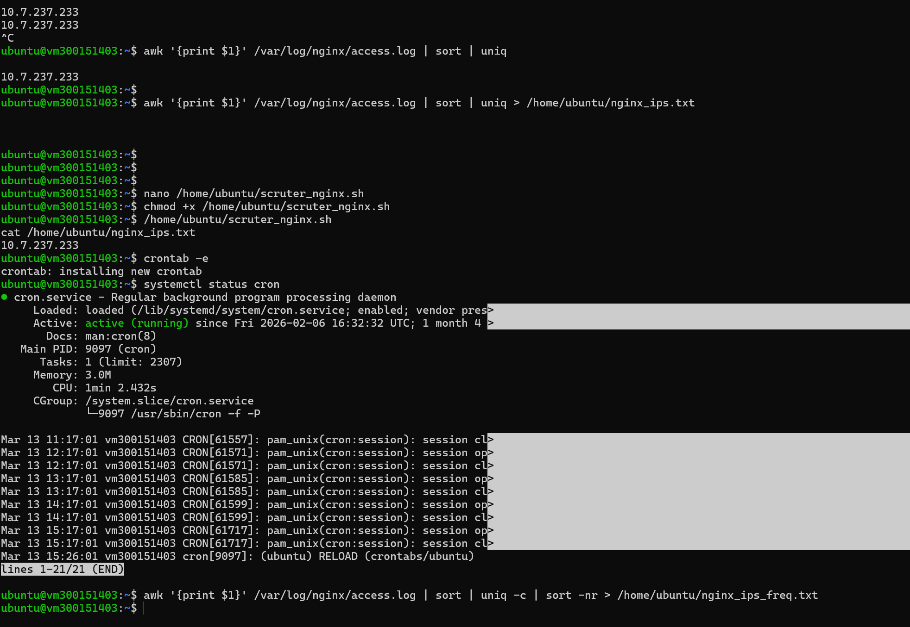

# 🛡️ NGINX LOG MONITORING PIPELINE ⚡
### 👤 Justin Sandy | DevOps & Security Automation Project

<p align="center">
  
</p>

<p align="center">
  
  
  
  
</p>

---

## 🚀 🌐 PROJECT OVERVIEW

```text
⚡ NGINX LOG MONITORING PIPELINE ACTIVE ⚡

[ WEB SERVER (NGINX) ]
          ↓
[ access.log / error.log ]
          ↓
[ BASH + AWK ANALYSIS ENGINE ]
          ↓
[ IP EXTRACTION + CLEANING ]
          ↓
[ TRAFFIC ANALYSIS (SORT / UNIQ / COUNT) ]
          ↓
[ OUTPUT FILES STORAGE ]
          ↓
[ CRON AUTOMATION ⏰ EVERY HOUR ]
