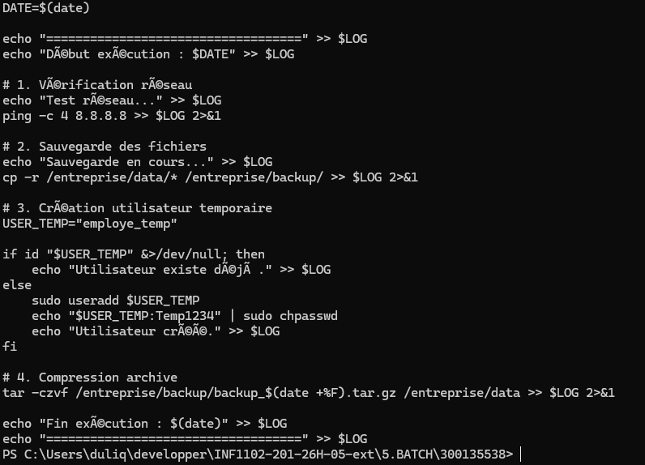
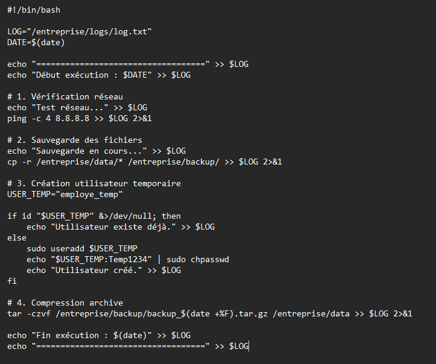

# 🧪 TP 5 — Automatisation d’administration avec script Batch (Linux)

## 👤 Informations étudiant

| Champ | Détails |
|---|---|
| Nom | Mohamed Reda El Youssoufi |
| Matricule | 300135538 |
| Cours | Programmation des systèmes |
| Travail | TP 5 — BATCH |

---

# 🎯 Objectif

Ce travail consiste à automatiser des tâches d’administration système sous Linux avec un script Bash.

Le script permet :

- ✔ Sauvegarder des fichiers d’entreprise
- ✔ Tester la connectivité réseau
- ✔ Créer un utilisateur temporaire
- ✔ Générer des journaux système
- ✔ Compresser des sauvegardes
- ✔ Planifier l’exécution avec Cron
- ✔ Vérifier les services Linux

---

# 🖥️ Environnement requis

- Ubuntu Server
- Accès sudo
- Service cron actif
- Terminal Linux

---

# 📁 Structure du projet

```text
5.BATCH/
└── 300135538/
    ├── README.md
    ├── script_gestion.sh
    └── images/
        ├── type.png
        └── script.png

``` id="w4y0q1"

# 📸 Captures d’écran

## Préparation de l’environnement



---

## Contenu du script Batch


