# TP – Automatisation d’administration avec script Batch (Linux)
TARIK TIDJET 
300150275
---

## 1. Objectif du TP

L’objectif de ce travail est de développer un script Bash permettant d’automatiser certaines tâches d’administration système sous Linux.

Le script doit :

- Sauvegarder un dossier d’entreprise
- Créer un utilisateur temporaire
- Tester la connectivité réseau
- Générer un fichier journal (log)
- Planifier l’exécution automatique avec cron
- Vérifier le bon fonctionnement
- Simuler et corriger des erreurs
- Implémenter une amélioration

---

## 2. Préparation de l’environnement

### 2.1 Création de la structure

Les dossiers nécessaires ont été créés :

- `/entreprise/data`
- `/entreprise/backup`
- `/entreprise/logs`

Deux fichiers de test ont ensuite été ajoutés dans le dossier `data`.

### 2.2 Capture de validation

La capture suivante démontre :

- La structure complète du dossier `/entreprise`
- La présence des fichiers `fichier1.txt` et `fichier2.txt`

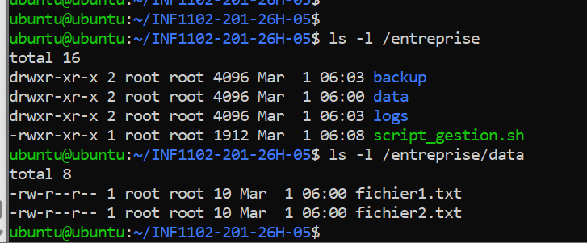

---

## 3. Création du script d’automatisation

### 3.1 Fichier créé

Le script a été créé dans :/entreprise/script_gestion.sh

### 3.2 Fonctionnalités intégrées

Le script réalise les actions suivantes :

- Définition d’un fichier log
- Test réseau via `ping 8.8.8.8`
- Copie des fichiers vers le dossier backup
- Création de l’utilisateur temporaire `employe_temp`
- Compression en archive `.tar.gz`
- Journalisation complète des opérations

---

## 4. Activation et test du script

### 4.1 Rendre le script exécutable

Le script a été rendu exécutable à l’aide de :sudo chmod +x /entreprise/script_gestion.sh

#### Capture de validation

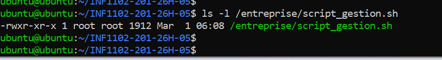

---

### 4.2 Exécution manuelle

Le script a été exécuté manuellement afin de vérifier son bon fonctionnement.

#### Capture d’exécution

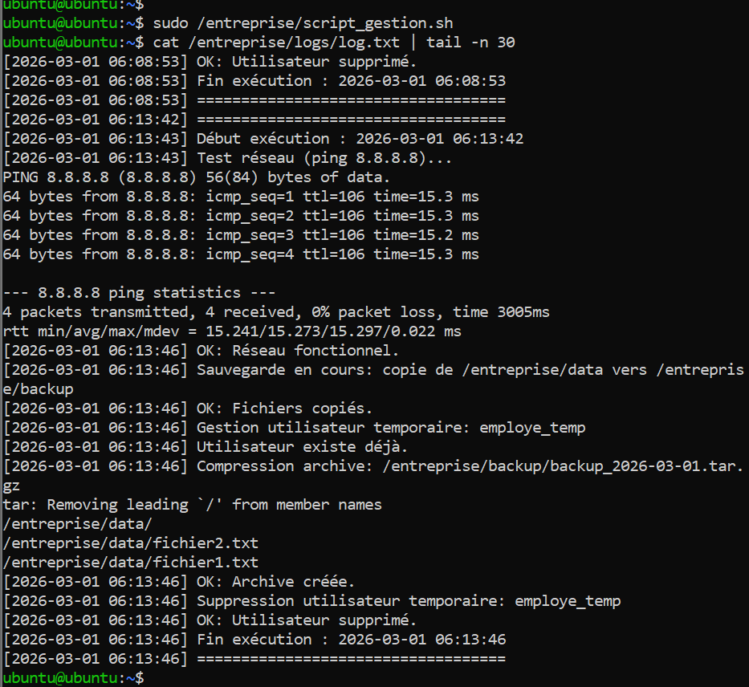

---

### 4.3 Vérification de la sauvegarde

La capture suivante démontre :

- La copie des fichiers
- La création de l’archive compressée

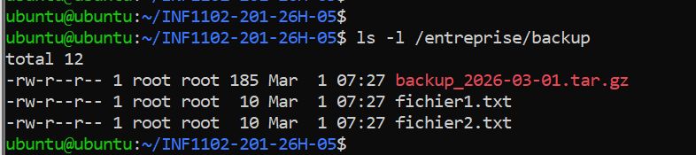

---

### 4.4 Vérification de l’utilisateur temporaire

L’utilisateur `employe_temp` a été créé automatiquement.

---

### 4.5 Vérification du fichier log

Le fichier log contient :

- Résultat du ping
- Copie des fichiers
- Création utilisateur
- Compression

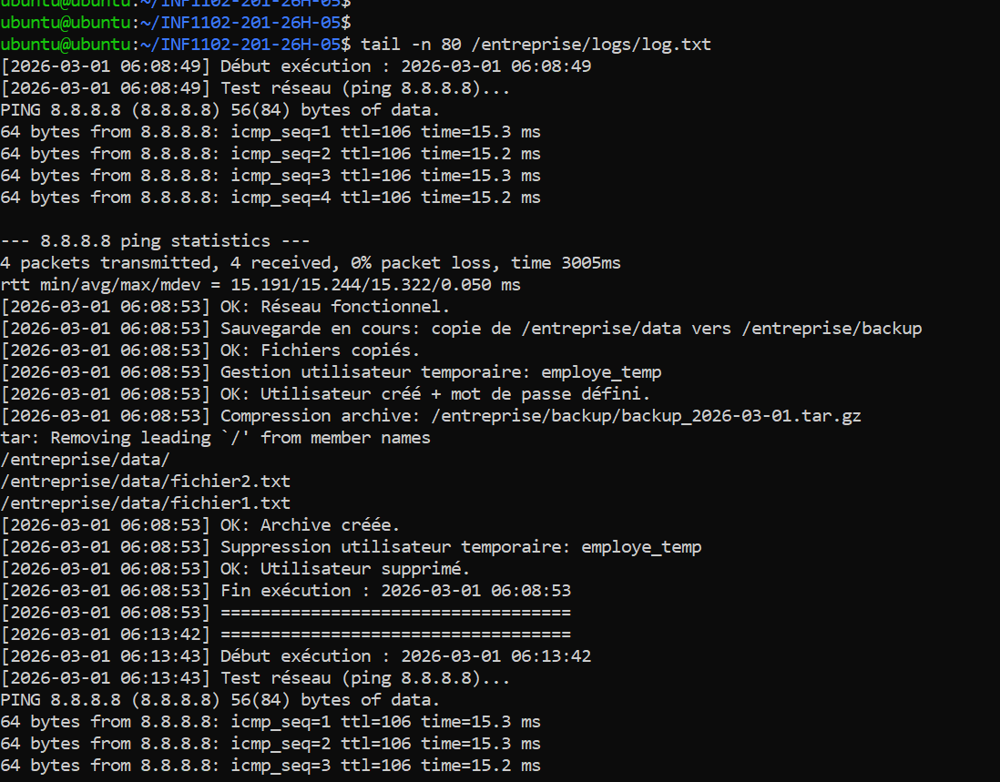

---

## 5. Planification automatique avec Cron

### 5.1 Configuration

Le script a été ajouté à la crontab :
#### Capture de validation

---

### 4.2 Exécution manuelle

Le script a été exécuté manuellement afin de vérifier son bon fonctionnement.

#### Capture d’exécution

---

### 4.3 Vérification de la sauvegarde

La capture suivante démontre :

- La copie des fichiers
- La création de l’archive compressée

---

### 4.4 Vérification de l’utilisateur temporaire

L’utilisateur `employe_temp` a été créé automatiquement.

---

### 4.5 Vérification du fichier log

Le fichier log contient :

- Résultat du ping
- Copie des fichiers
- Création utilisateur
- Compression

---

## 5. Planification automatique avec Cron

### 5.1 Configuration

Le script a été ajouté à la crontab :0 2 * * * /entreprise/script_gestion.sh

### 5.2 Capture de validation

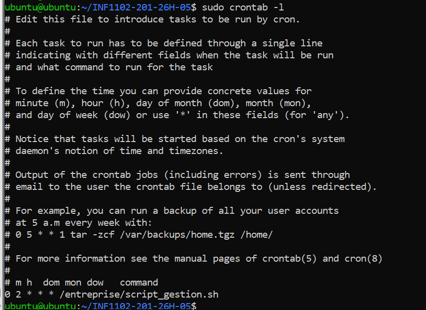

---

## 6. Vérification du service Cron

Les journaux système ont été consultés afin de confirmer le bon fonctionnement du service cron.

La capture démontre :

- Le service actif
- Les sessions ouvertes par cron
- L’exécution des tâches planifiées

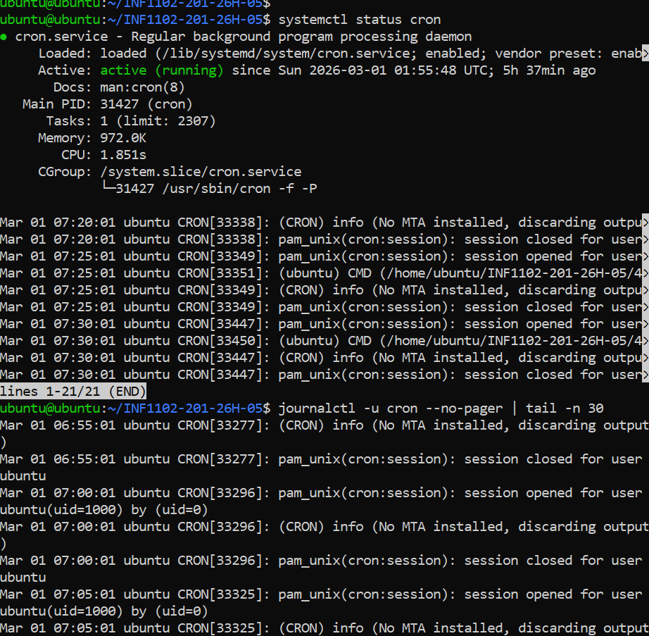

---

## 7. Dépannage

### 7.1 Simulation d’erreur – Permission denied

Le droit d’exécution a été retiré afin de simuler une erreur.

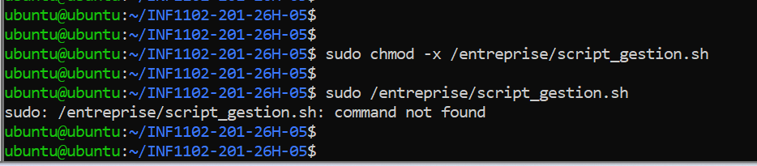

Correction effectuée :sudo chmod +x /entreprise/script_gestion.sh

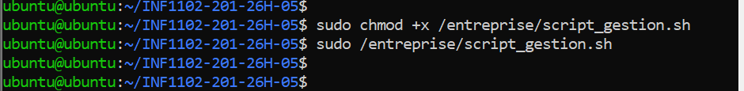

---

### 7.2 Simulation d’erreur – Mauvais PATH Cron

Une configuration volontairement incorrecte a été utilisée :*/1 * * * * script_gestion.sh

Cela provoque une erreur due à l’absence de chemin absolu.

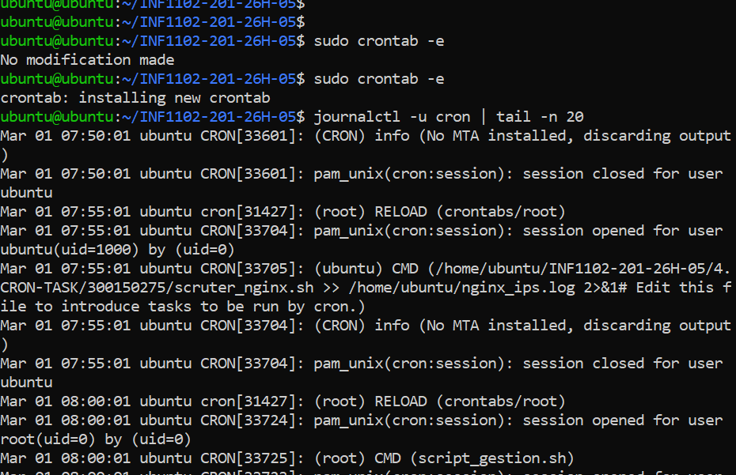

Correction : utilisation du chemin complet `/entreprise/script_gestion.sh`.

---

## 8. Amélioration du script

### 8.1 Suppression automatique de l’utilisateur

Le script a été amélioré pour supprimer automatiquement l’utilisateur temporaire après exécution.

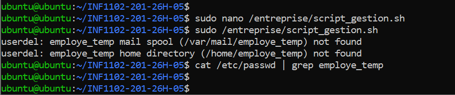

### 8.2 Gestion d’erreur

Une condition a été ajoutée afin de vérifier le code de retour :f [ $? -ne 0 ]; then
echo "Erreur lors de la sauvegarde" >> $LOG fi

f [ $? -ne 0 ]; then
echo "Erreur lors de la sauvegarde" >> $LOG
fi

---

## 9. Conclusion

Ce TP démontre la mise en place d’une automatisation complète sous Linux incluant :

- Gestion des fichiers
- Gestion des utilisateurs
- Planification avec cron
- Journalisation
- Diagnostic
- Correction d’erreurs
- Amélioration du script

L’ensemble des étapes a été validé par captures d’écran.

