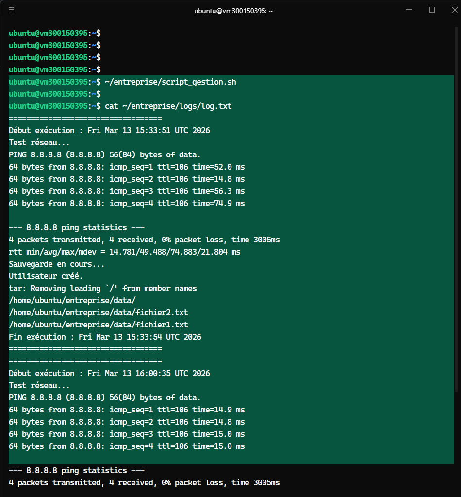
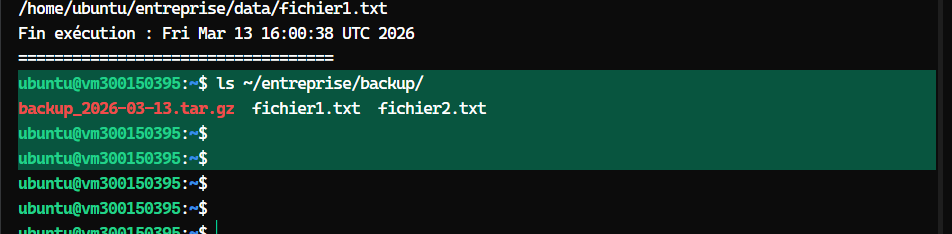
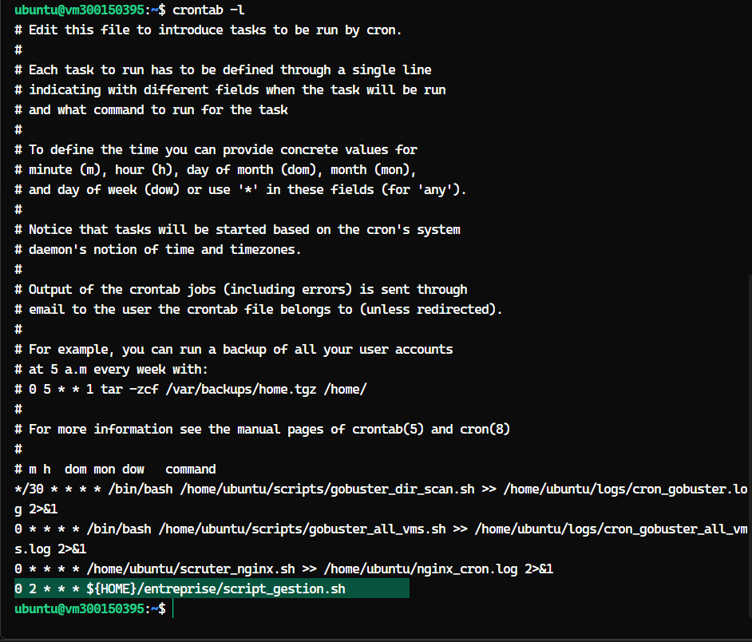

# 🔍 Gobuster VM Scanner

[](https://www.gnu.org/software/bash/)
[](https://go.dev/)
[](https://www.proxmox.com/)
[](LICENSE)

> **INF1102 - Batch & Cron** | Infrastructure as Code Project  
> **Auteur:** 300150395

Script batch pour scanner automatiquement les VMs Proxmox et identifier les serveurs web exposés via **directory enumeration** avec Gobuster.

---

## 📋 Sommaire

- [Architecture](#-architecture)
- [Fonctionnement](#-fonctionnement)
- [Installation](#-installation)
- [Utilisation](#-utilisation)
- [Automatisation Cron](#-automatisation-cron)
- [Résultats](#-résultats)

---

## 🏗️ Architecture

```
┌─────────────────┐     ┌──────────────┐     ┌─────────────┐     ┌─────────────┐
│  Proxmox VMs    │────▶│  Batch Script │────▶│  Gobuster   │────▶│   GitHub    │
│ (10.7.237.224)  │     │  (Detection)  │     │   (Scan)    │     │  (Reports)  │
│      ...        │     │               │     │             │     │             │
│ (10.7.237.245)  │     │               │     │             │     │             │
└─────────────────┘     └──────────────┘     └─────────────┘     └─────────────┘
                               │
                               ▼
                        ┌──────────────┐
                        │  Logs Local  │
                        │ ~/logs/gobuster/
                        └──────────────┘
```

**Plage d'IP:** `10.7.237.224` → `10.7.237.245` (22 VMs)

---

## ⚙️ Fonctionnement

### 1️⃣ Détection des VMs Actives

```bash
curl -sS --max-time 2 -I "http://$IP" >/dev/null 2>&1
```

| Paramètre | Valeur |
|-----------|--------|
| VMs scannées | 22 |
| Timeout | 2 secondes |
| Durée max | 44 secondes |
| VMs détectées UP | ~10/22 |

### 2️⃣ Gobuster Directory Enumeration

```bash
gobuster dir \
  -u "http://$IP" \
  -w raft-medium-directories.txt \
  -x html,php,txt \
  -t 5 \
  --timeout 3s \
  -q
```

**Options utilisées:**
- `-w` : Wordlist (~30k entrées)
- `-x` : Extensions ciblées
- `-t 5` : 5 threads
- `-q` : Mode silencieux

**Exemple de résultat:**
```
10.7.237.226 → index.html (Status: 200) [Size: 21764]
10.7.237.229 → index.html (Status: 200) [Size: 4772]
```

### 3️⃣ Structure des Logs

```
~/logs/gobuster/
├── run_2026-02-21_070654.log          # Scans réussis
├── skipped_2026-02-21_070654.log      # VMs down
└── dir_10.7.237.226_20260221.txt      # Résultats Gobuster par IP
```

---

## 📊 Résultats du Scan (2026-02-21)

| IP | Statut | Endpoint | Taille |
|:---|:------:|:---------|:------:|
| 10.7.237.226 | 🟢 UP | `index.html` | 21 KB |
| 10.7.237.229 | 🟢 UP | `index.html` | 4 KB |
| 10.7.237.230 | 🟢 UP | `index.html` | 1 KB |

**Statistiques:**
- 🟢 **10 VMs UP** / 22 total
- 📈 **Taux de détection:** 45%
- ⏱️ **Durée moyenne:** ~3 minutes

---

## 🚀 Installation

### Prérequis

```bash
# Installation de Gobuster
go install github.com/OJ/gobuster/v3@latest
export PATH=$PATH:$HOME/go/bin

# Installation de SecLists
snap install seclists
```

### Déploiement

```bash
# Cloner le repository
git clone https://github.com/300150395/reports.git
cd reports/gobuster

# Rendre le script exécutable
chmod +x gobuster_all_vms.sh
```

---

## 💻 Utilisation

### Exécution manuelle

```bash
# Lancer le scan
bash ~/scripts/gobuster_all_vms.sh

# Consulter les logs
cat ~/logs/gobuster/run_*.log
```

### Personnalisation

| Variable | Description | Défaut |
|----------|-------------|--------|
| `IP_BASE` | Base du réseau | `10.7.237` |
| `IP_START` | IP de départ | `224` |
| `IP_END` | IP de fin | `245` |
| `WORDLIST` | Chemin wordlist | `/usr/share/seclists/...` |

---

## ⏰ Automatisation Cron

### Configuration

```bash
# Éditer le crontab
crontab -e
```

### Tâche planifiée (toutes les heures)

```cron
# Gobuster VM Scanner - Exécution à chaque heure pleine
0 * * * * /home/ubuntu/scripts/gobuster_all_vms.sh >> /home/ubuntu/logs/cron_gobuster.log 2>&1
```

### Planning suggéré

| Fréquence | Expression | Usage |
|-----------|------------|-------|
| Toutes les heures | `0 * * * *` | Surveillance continue |
| Toutes les 6h | `0 */6 * * *` | Scan périodique |
| Quotidien | `0 2 * * *` | Scan nocturne |

---

## 🛠️ Technologies

| Technologie | Usage |
|-------------|-------|
|  | Scripting batch |
|  | Gobuster (directory busting) |
|  | Infrastructure VMs |
|  | Stockage rapports |
|  | Planification |


---

## 📁 Structure du Projet

```
.
📁 5.BATCH/300150395/
├── gobuster_all_vms.sh        ✅ Script final
├── gobuster_all_vms_v1.sh     ✅ Script v1
├── README.md                  ✅ Documentation
└── reports/gobuster/
    ├── gobuster_run_2026-02-21_070654.log       ✅
    └── gobuster_run_2026-02-21_094241_full.log  ✅
```


---

## 📝 Notes

- ✅ **Scalable:** Facilement adaptable (plage IP, wordlists, ports)
- 🔒 **Sécurisé:** Utilise `set -euo pipefail`
- 📊 **Traçable:** Logs horodatés pour audit

---


# 5.BATCH - ISMAIL TRACHE (300150395)

## Script fonctionnel

✅ `/entreprise/` structure créée à la racine  
✅ Backup + tar.gz + ping + useradd  
✅ Cron 2h00 quotidien  
✅ Logs complets  

5.BATCH/300150395/
├── README.md
├── script_gestion.sh       ← le script corrigé
└── images/
    ├── 1.png               ← preuve structure /entreprise/
    ├── 2.png               ← preuve log.txt
    └── 3.png               ← preuve crontab


## Preuves

</img>
</img>
</img>


<div align="center">


**300150395 - Infrastructure as Code Project**

[](https://github.com/ismailtrache)

</div>
