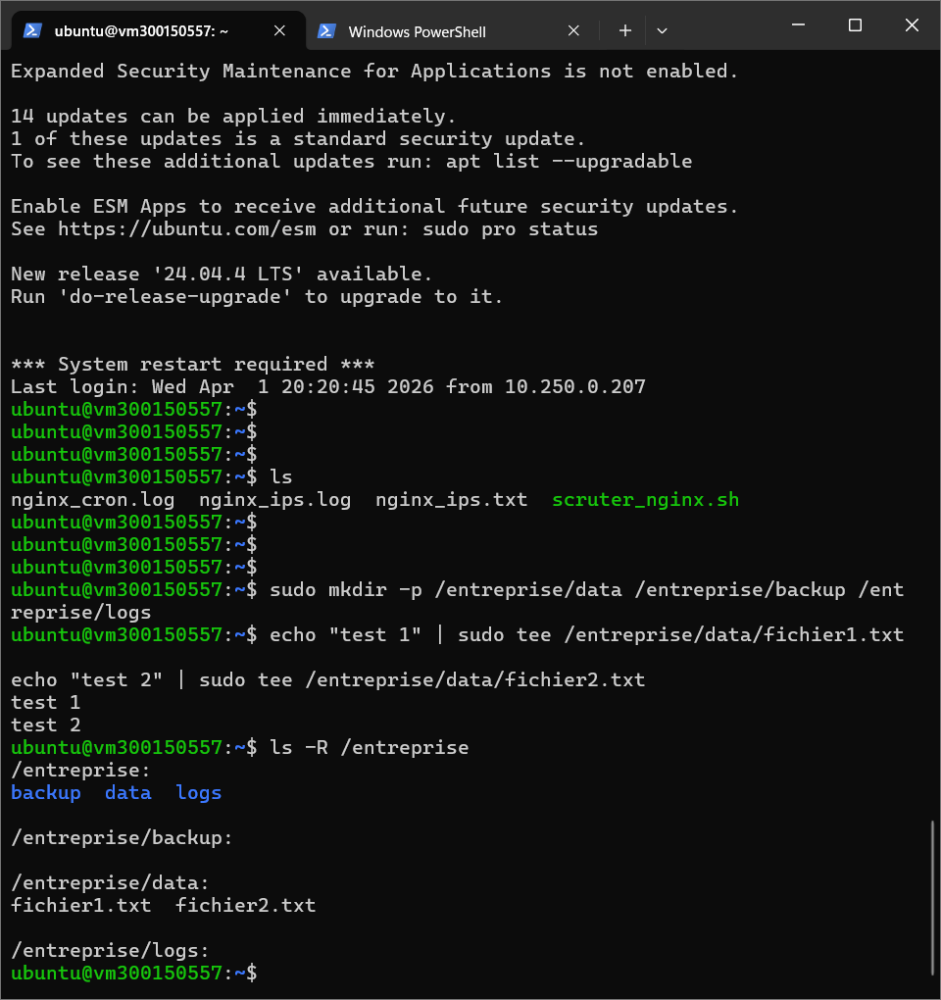
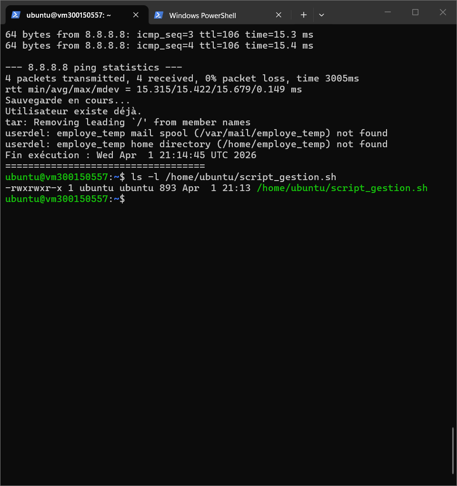
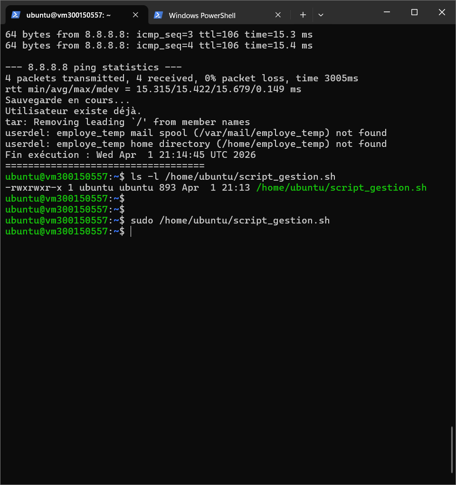
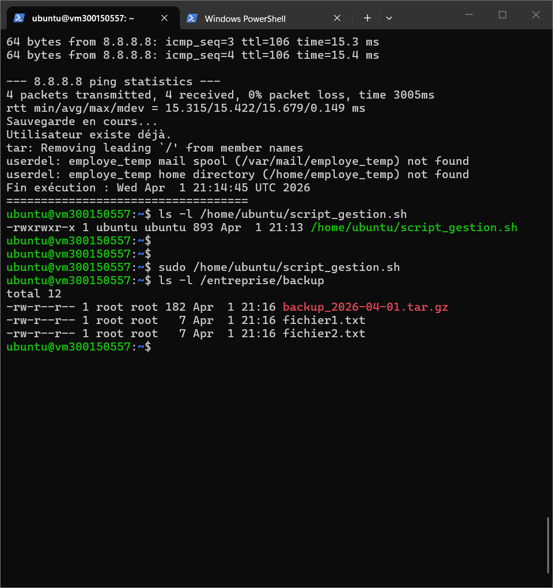
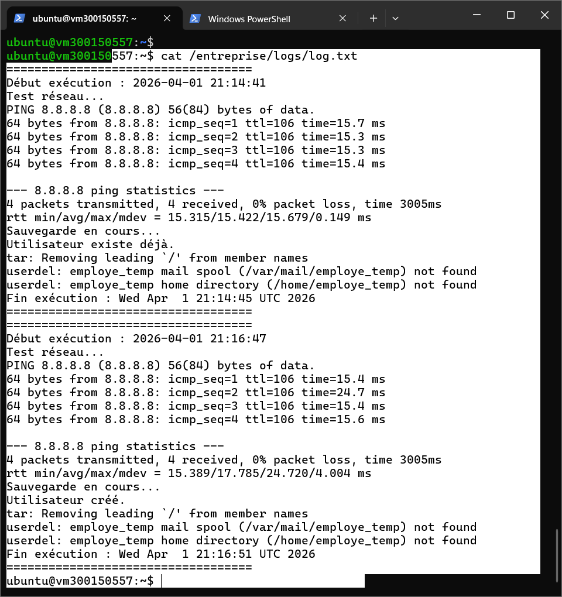

# TP – Automatisation d'administration avec script Batch (Linux)


*\*Nom :\*\* Hani Aghilas Damouche

*\*Numéro étudiant :\*\* 300150557


---


## 1. Objectif du TP


L'objectif de ce travail est de développer un script Bash permettant d'automatiser certaines tâches d'administration système sous Linux.


Le script permet de :

- Sauvegarder un dossier d'entreprise

- Créer un utilisateur temporaire

- Tester la connectivité réseau

- Générer un fichier journal

- Planifier l'exécution automatique avec cron

- Vérifier le bon fonctionnement

- Simuler et corriger des erreurs

- Implémenter une amélioration


---


## 2. Préparation de l'environnement


### 2.1 Création de la structure


Les dossiers suivants ont été créés :

- `/entreprise/data`

- `/entreprise/backup`

- `/entreprise/logs`


Deux fichiers de test ont été ajoutés dans le dossier `data`.


### 2.2 Commandes utilisées

```bash

sudo mkdir -p /entreprise/data /entreprise/backup /entreprise/logs

echo "test 1" | sudo tee /entreprise/data/fichier1.txt

echo "test 2" | sudo tee /entreprise/data/fichier2.txt

```


### 2.3 Capture de validation


</img>


---


## 3. Création du script d'automatisation


### 3.1 Emplacement du script


Le script a été créé dans :

```

/home/ubuntu/script\_gestion.sh

```


### 3.2 Fonctionnalités intégrées


Le script réalise les actions suivantes :


- Création des dossiers si nécessaire

- Test réseau via `ping 8.8.8.8`

- Copie des fichiers vers le dossier backup

- Création de l'utilisateur temporaire `employe\_temp`

- Compression en archive `.tar.gz`

- Journalisation complète des opérations

- Suppression automatique de l'utilisateur temporaire


### 3.3 Contenu du script

```bash

#!/bin/bash


mkdir -p /entreprise/data

mkdir -p /entreprise/backup

mkdir -p /entreprise/logs


LOG="/entreprise/logs/log.txt"

USER\_TEMP="employe\_temp"

DATE=$(date '+%Y-%m-%d %H:%M:%S')


echo "===================================" >> "$LOG"

echo "Début exécution : $DATE" >> "$LOG"


echo "Test réseau..." >> "$LOG"

ping -c 4 8.8.8.8 >> "$LOG" 2>\&1


echo "Sauvegarde en cours..." >> "$LOG"

cp -r /entreprise/data/\* /entreprise/backup/ >> "$LOG" 2>\&1


if id "$USER\_TEMP" >/dev/null 2>\&1; then

&#x20;   echo "Utilisateur $USER\_TEMP existe déjà." >> "$LOG"

else

&#x20;   sudo useradd "$USER\_TEMP"

&#x20;   echo "$USER\_TEMP:Temp1234" | sudo chpasswd

&#x20;   echo "Utilisateur $USER\_TEMP créé." >> "$LOG"

fi


tar -czf /entreprise/backup/backup\_$(date +%F).tar.gz /entreprise/data >> "$LOG" 2>\&1


if id "$USER\_TEMP" >/dev/null 2>\&1; then

&#x20;   sudo userdel "$USER\_TEMP" >> "$LOG" 2>\&1

&#x20;   echo "Utilisateur $USER\_TEMP supprimé." >> "$LOG"

fi


echo "Fin exécution : $(date)" >> "$LOG"

echo "===================================" >> "$LOG"

```


---


## 4. Activation et test du script


### 4.1 Rendre le script exécutable

```bash

chmod +x /home/ubuntu/script\_gestion.sh

```


### 4.2 Exécution manuelle

```bash

sudo /home/ubuntu/script\_gestion.sh

```


### 4.3 Vérification de la sauvegarde


La sauvegarde et l'archive compressée ont été créées dans `/entreprise/backup`.


</img>


### 4.4 Vérification du fichier log


Le fichier log contient le test réseau, la sauvegarde, la création de l'utilisateur, la compression et la suppression.


</img>


---


## 5. Planification automatique avec Cron


### 5.1 Configuration


Le script a été ajouté à la crontab avec la commande suivante :

```bash

(crontab -l 2>/dev/null; echo "0 2 \* \* \* sudo /home/ubuntu/script\_gestion.sh") | crontab -

```


### 5.2 Vérification

```bash

crontab -l

```


</img>


---


## 6. Dépannage


### 6.1 Erreur de permission sur le fichier log


Lors du premier test, une erreur de permission est apparue sur `/entreprise/logs/log.txt`.


Correction appliquée :

```bash

sudo chown -R ubuntu:ubuntu /entreprise

```


</img>


### 6.2 Simulation d'erreur – Permission denied


Le droit d'exécution peut être retiré pour simuler une erreur :

```bash

chmod -x /home/ubuntu/script\_gestion.sh

/home/ubuntu/script\_gestion.sh

```


Puis corrigé avec :

```bash

chmod +x /home/ubuntu/script\_gestion.sh

```


---


## 7. Conclusion


Ce TP démontre la mise en place d'une automatisation complète sous Linux incluant :


- La gestion des fichiers

- La gestion des utilisateurs

- La planification avec cron

- La journalisation

- Le diagnostic

- La correction d'erreurs

- Une amélioration du script


---


> \*Document produit dans le cadre du cours d'administration système — Collège Boréal\*

