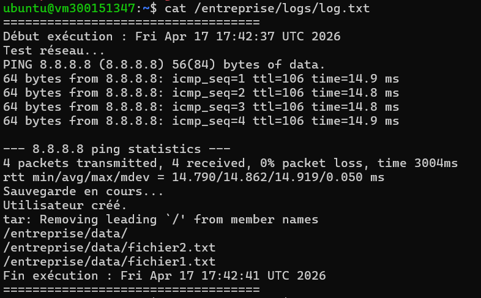

# 🧪 TP – Automatisation d'administration avec script Batch (Linux)

| 👤 Étudiante | 🎓 Numéro étudiant | 🏫 Programme |
|---|---|---|
| Sara Hocine | 300151347 | INF1102 – DevOps / Administration Linux |

---

## 🎯 Objectif

Programmer un script Batch sous Linux permettant de :

- 📁 Sauvegarder un dossier d'entreprise
- 👤 Créer un utilisateur temporaire
- 🌐 Tester la connectivité réseau
- 📜 Générer un fichier journal (log)
- ⏰ Planifier l'exécution automatique avec `cron`
- 🔍 Vérifier l'exécution et diagnostiquer les erreurs

---

## 🖥 Environnement requis

| Élément | Détail |
|---|---|
| Distribution | Ubuntu Server (22.04) |
| Accès | `sudo` |
| Terminal | bash |
| Service | `cron` actif |

---

## 🔹 PARTIE 1 – Préparation de l'environnement

```bash
sudo mkdir -p /entreprise/data
sudo mkdir -p /entreprise/backup
sudo mkdir -p /entreprise/logs
echo "Fichier 1" | sudo tee /entreprise/data/fichier1.txt
echo "Fichier 2" | sudo tee /entreprise/data/fichier2.txt
```

---

## 🔹 PARTIE 2 – Création du script Batch

```bash
sudo nano /entreprise/script_gestion.sh
```

```bash
#!/bin/bash
LOG="/entreprise/logs/log.txt"
DATE=$(date)

echo "===================================" >> $LOG
echo "Début exécution : $DATE" >> $LOG

# 1. Vérification réseau
echo "Test réseau..." >> $LOG
ping -c 4 8.8.8.8 >> $LOG 2>&1

# 2. Sauvegarde des fichiers
echo "Sauvegarde en cours..." >> $LOG
cp -r /entreprise/data/* /entreprise/backup/ >> $LOG 2>&1

# 3. Création utilisateur temporaire
USER_TEMP="employe_temp"
if id "$USER_TEMP" &> /dev/null; then
    echo "Utilisateur existe déjà." >> $LOG
else
    sudo useradd $USER_TEMP
    echo "$USER_TEMP:Temp1234" | sudo chpasswd
    echo "Utilisateur créé." >> $LOG
fi

# 4. Compression archive
tar -czvf /entreprise/backup/backup_$(date +%F).tar.gz /entreprise/data >> $LOG 2>&1

echo "Fin exécution : $(date)" >> $LOG
echo "===================================" >> $LOG
```

---

## 🔹 PARTIE 3 – Rendre le script exécutable

```bash
sudo chmod +x /entreprise/script_gestion.sh
```

---

## 🔹 PARTIE 4 – Test manuel et vérifications

```bash
sudo /entreprise/script_gestion.sh
```

### ✅ Backup

```bash
ls /entreprise/backup/
```


---

### ✅ Utilisateur temporaire

```bash
cat /etc/passwd | grep employe_temp
```


---

### ✅ Fichier log

```bash
cat /entreprise/logs/log.txt
```



---

## 🔹 PARTIE 5 – Planification avec Cron

```bash
sudo crontab -e
```

Ajouter :
