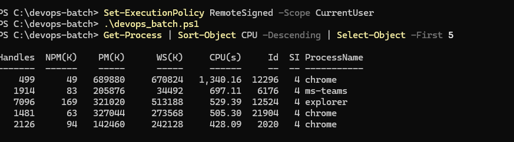
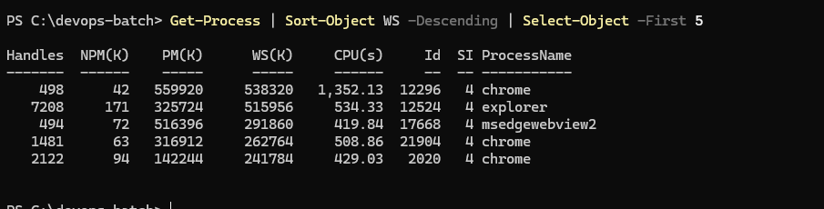
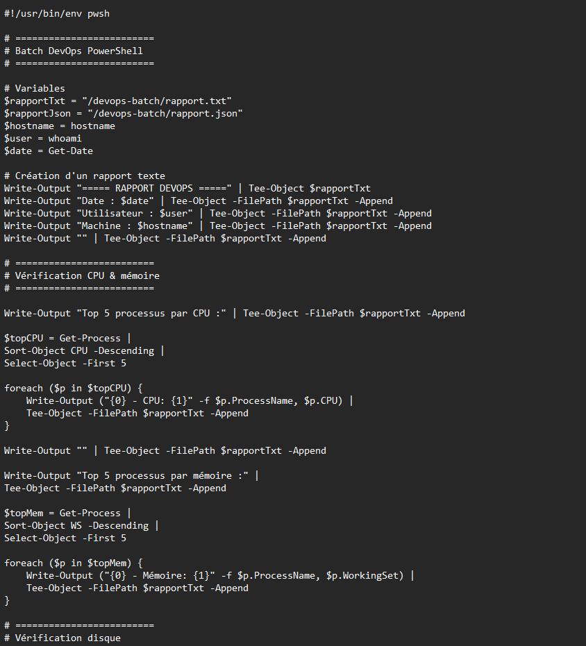
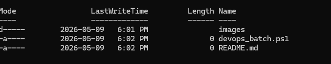

# 🧪 TP 6 — PowerShell DevOps Batch

## 👤 Informations étudiant

| Champ | Détails |
|---|---|
| Nom | Mohamed Reda El Youssoufi |
| Matricule | 300135538 |
| Travail | TP6 — PowerShell |
| Technologie | PowerShell |
| Environnement | Windows / PowerShell |

---

# 🎯 Objectif

Ce laboratoire permet de pratiquer PowerShell afin de :

- vérifier les processus CPU
- analyser l’utilisation mémoire
- vérifier les disques
- créer un script PowerShell
- manipuler les commandes système
- organiser un projet DevOps

---

# 📁 Structure du projet
---

# 📸 Captures d’écran

## Version PowerShell


---

## Analyse CPU



---

## Analyse mémoire



---

## Contenu du script



---

## Structure du projet


```
