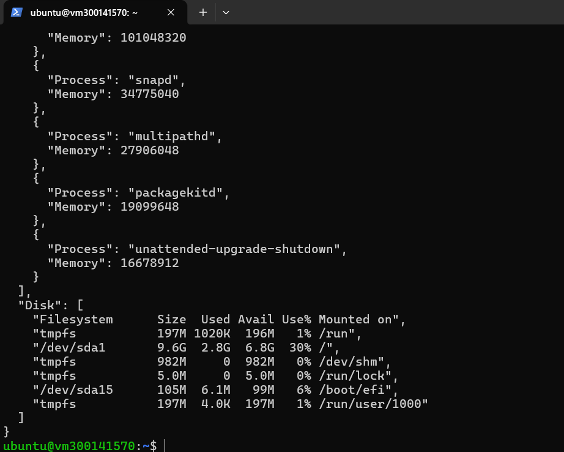
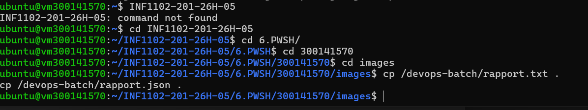

# 🧾 6.PWSH – DevOps PowerShell

## 🎯 Objectif  
Dans ce travail, nous avons réalisé un script PowerShell sous Linux permettant d’automatiser des tâches DevOps et de générer des rapports système.

---

## ⚙️ Script utilisé  

Le script `devops_batch.ps1` permet de :

- récupérer les informations système  
- afficher les processus CPU et mémoire  
- vérifier l’espace disque  
- tester la connexion SSH  
- générer un rapport texte et JSON  

---

## 🚀 Exécution du script  

```bash
sudo pwsh /devops-batch/devops_batch.ps1
```

---

## 📸 Exécution du script  



👉 Cette capture montre l’exécution du script PowerShell avec les résultats affichés dans le terminal.

---

## 📸 Résultat JSON généré  



👉 Cette capture montre le contenu du fichier `rapport.json` avec les informations système.

---

## 📂 Fichiers générés  

- rapport.txt  
- rapport.json  

---

## 🔍 Vérification  

```bash
cat rapport.txt
cat rapport.json
```

---

## 🧠 Conclusion  

Ce travail nous a permis de :

- automatiser des tâches DevOps  
- utiliser PowerShell sous Linux  
- générer des rapports structurés  

👉 PowerShell facilite l’automatisation grâce à son approche orientée objets.
