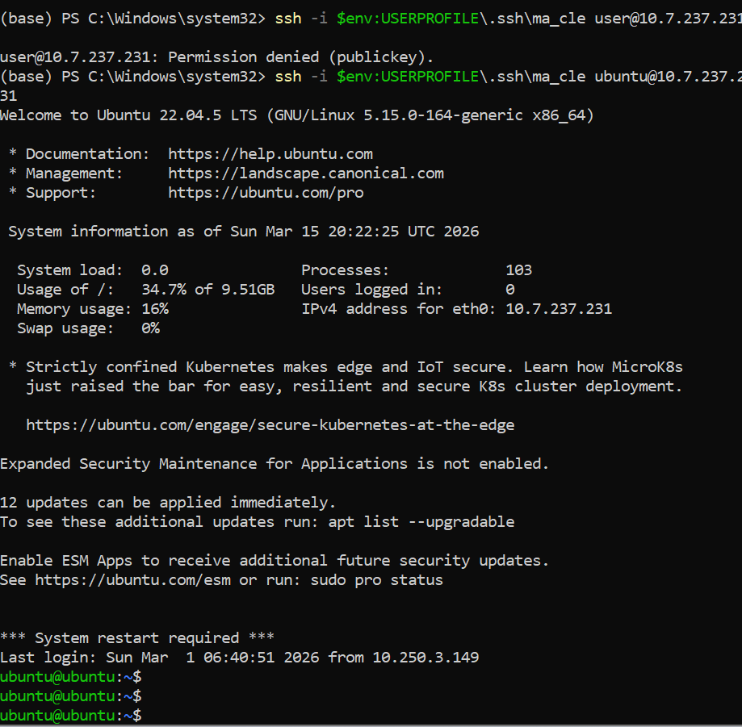
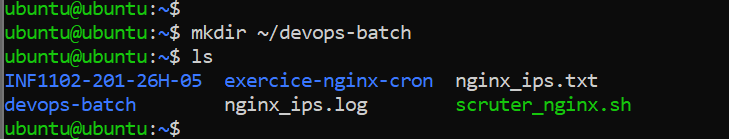
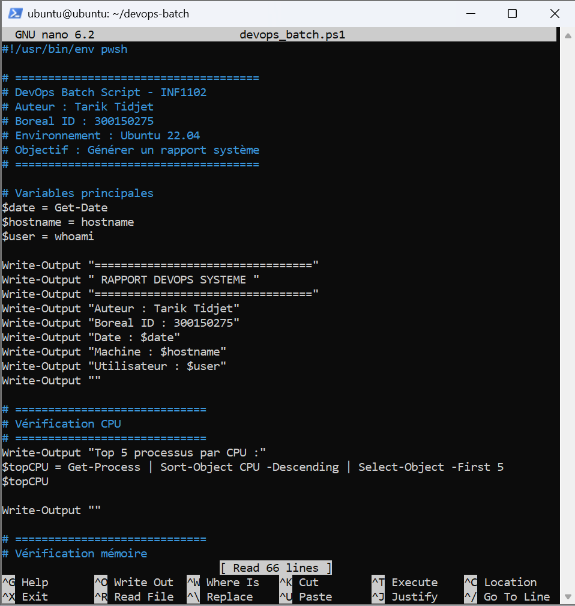
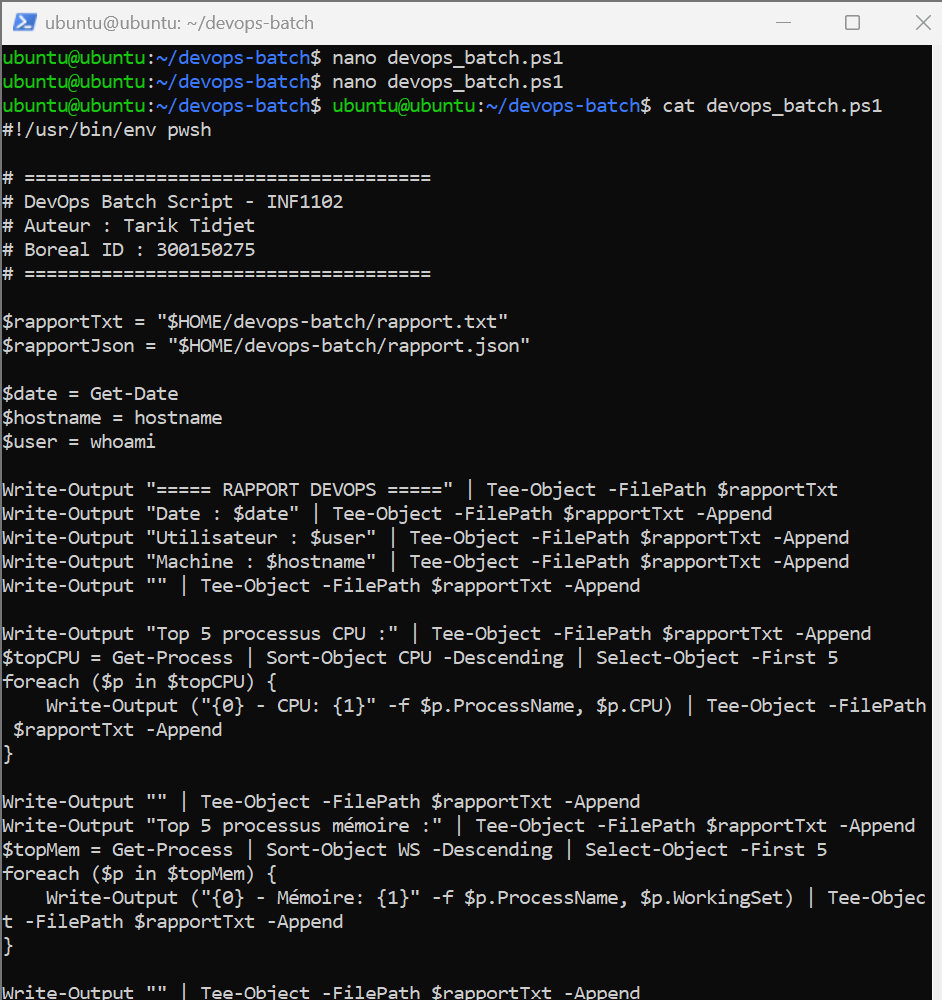

# TP DevOps – Automatisation avec PowerShell sous Linux

## Étudiant

**Nom :** Tarik Tidjet  
**Boréal ID :** 300150275  
**Cours :** INF1102  
**Environnement :** Ubuntu 22.04 LTS  
**Shell utilisé :** PowerShell 7.5.5  

---

# 1. Introduction

Dans ce laboratoire, l’objectif est d’installer **PowerShell sur Ubuntu 22.04** et de développer un **script DevOps permettant d’automatiser plusieurs tâches d’administration système**.

L’automatisation permet de simplifier la gestion d’un système Linux en collectant automatiquement des informations importantes et en générant des rapports exploitables.

Le script développé permet notamment :

- de récupérer des informations système
- d’analyser l’utilisation CPU et mémoire
- de vérifier la connectivité SSH
- de générer des rapports automatisés

---

# 2. Connexion SSH à la machine Ubuntu

La première étape consiste à se connecter à la machine Ubuntu afin d’exécuter les commandes nécessaires au laboratoire.

Cette connexion est réalisée via **SSH**.



---

# 3. Création du dossier du projet

Un dossier de travail est créé afin d’organiser les fichiers du laboratoire.

Ce dossier contiendra :

- le script PowerShell
- les rapports générés
- les captures d’écran



---

# 4. Création du script DevOps

Un script nommé **devops_batch.ps1** est créé afin d’automatiser plusieurs tâches d’administration système.

Ce script est développé dans **PowerShell sous Linux**.



---

# 5. Contenu du script

Le script récupère différentes informations système importantes.

Les informations collectées incluent :

- la date et l’heure du système
- le nom de l’utilisateur
- le nom de la machine
- les processus utilisant le plus de CPU
- les processus utilisant le plus de mémoire
- l’utilisation du disque
- un test de connectivité SSH

Toutes ces informations sont ensuite enregistrées dans des rapports.



---

# 6. Exécution du script

Le script est exécuté à l’aide de PowerShell avec les commandes suivantes :

```bash
pwsh
./devops_batch.ps1