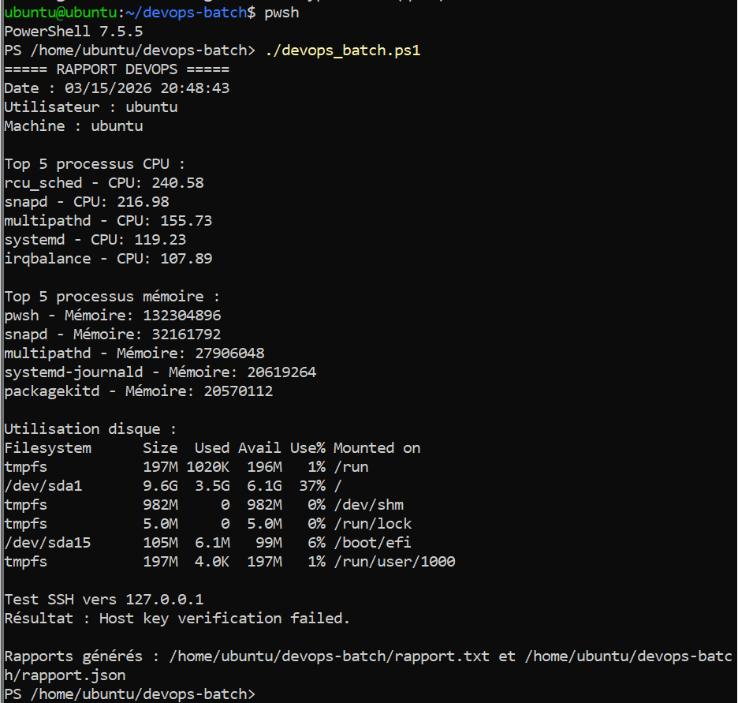

\# TP – Batch DevOps PowerShell sous Linux


\*\*Nom :\*\* Tarik Tidjet  

\*\*Boréal ID :\*\* 300150275  

\*\*Cours :\*\* INF1102  

\*\*Environnement :\*\* Ubuntu 22.04 LTS  

\*\*Shell :\*\* PowerShell 7.5.5  


\## Objectif du laboratoire


Ce laboratoire a pour objectif d’installer PowerShell sur Ubuntu 22.04 et de créer un script DevOps permettant d’automatiser plusieurs tâches d’administration système.


\## Travail réalisé


Le script `devops\_batch.ps1` permet de :


\- récupérer la date, l’utilisateur et le nom de la machine

\- afficher les 5 processus les plus gourmands en CPU

\- afficher les 5 processus les plus gourmands en mémoire

\- afficher l’utilisation du disque

\- tester la connectivité SSH vers `127.0.0.1`

\- générer un rapport texte

\- générer un rapport JSON


\## Installation de PowerShell


Les commandes utilisées pour installer PowerShell sur Ubuntu 22.04 sont les suivantes :


```bash

sudo apt update

sudo apt install -y wget apt-transport-https software-properties-common

wget https://packages.microsoft.com/config/ubuntu/22.04/packages-microsoft-prod.deb

sudo dpkg -i packages-microsoft-prod.deb

sudo apt update

sudo apt install -y PowerShell

## Captures d'écran

### Connexion SSH à la machine Ubuntu


---

### Création du dossier du projet


---

### Création du script DevOps


---

### Contenu du script DevOps


---

### Exécution du script



---

### Rapports générés


