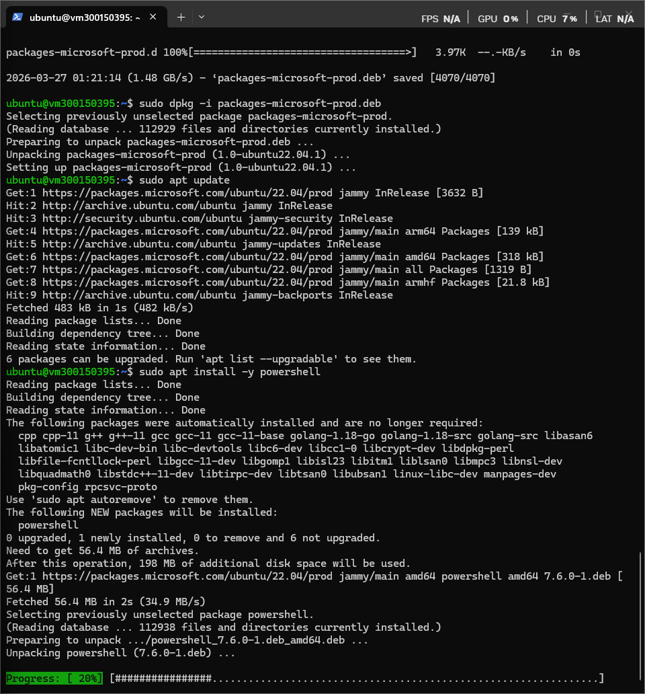
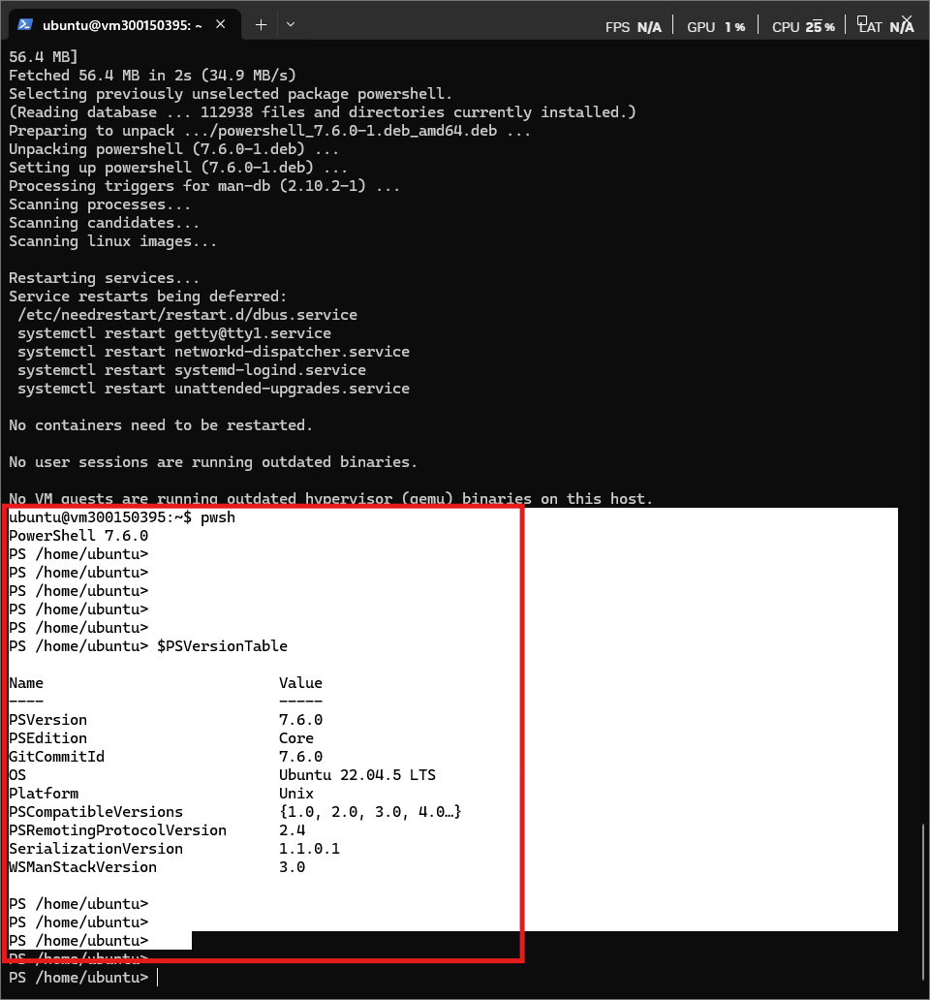
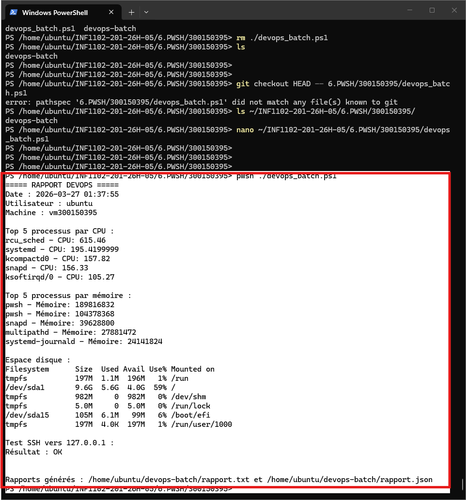
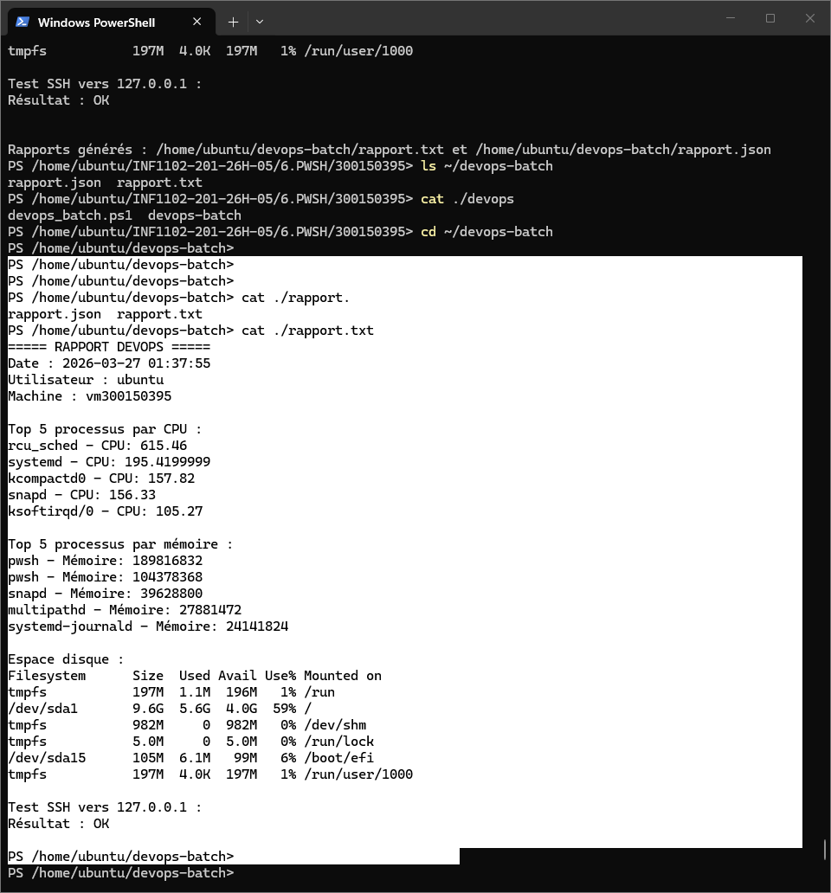
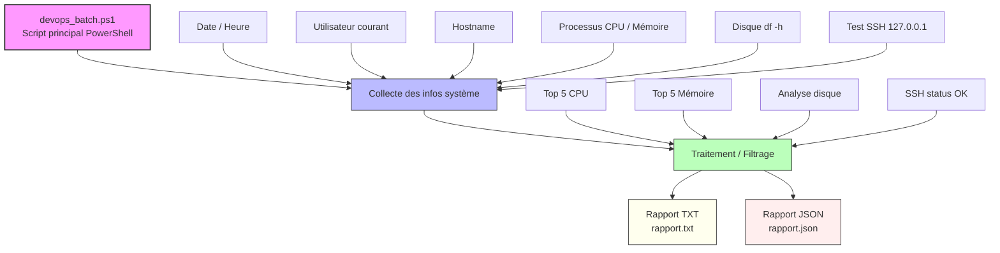

# :six: PWSH (PowerShell) — TP DevOps


**Nom :** Ismail Trache

**Boréal ID :** 300150395

**Cours :** INF1102

**Environnement :** Ubuntu 22.04 LTS

**Shell :** PowerShell (pwsh)

---

## :floppy_disk: Installation de PowerShell sur Ubuntu 22.04

### 1. Mettre à jour le système

```bash
sudo apt update
```

### 2. Installer les dépendances

```bash
sudo apt install -y wget apt-transport-https software-properties-common
```

### 3. Ajouter le dépôt Microsoft

```bash
wget https://packages.microsoft.com/config/ubuntu/22.04/packages-microsoft-prod.deb
sudo dpkg -i packages-microsoft-prod.deb
```

### 4. Mettre à jour les dépôts

```bash
sudo apt update
```

### 5. Installer PowerShell

```bash
sudo apt install -y powershell
```

### 6. Lancer PowerShell

```bash
pwsh
```

Prompt :

```
PS /home/ubuntu>
```



### 7. Vérifier la version

```powershell
$PSVersionTable
```

### 8. Passage de Bash à PowerShell

Depuis un terminal Bash classique :

```bash
# Terminal Bash
ubuntu@vm300150395:~$ pwsh
```

Une fois dans PowerShell :

```
PS /home/ubuntu>
```

Pour quitter PowerShell et retourner à Bash :

```powershell
exit
```



---

# :test_tube: Laboratoire — Créer un batch DevOps PowerShell

Durée : **90 à 120 minutes**
Environnement : **Ubuntu 22.04 (Jammy)**
Shell : **PowerShell (pwsh)**

---

## :o: Objectifs

À la fin de ce laboratoire, l'étudiant sera capable de :

1. Créer un **script batch PowerShell** pour Linux.
2. Vérifier l'état du système (CPU, mémoire, disque).
3. Vérifier la connectivité réseau (SSH).
4. Générer un **rapport texte et JSON**.
5. Automatiser des tâches **administratives et DevOps**.
6. Comprendre le pipeline **PowerShell orienté objets**.

---

## 🔹 PARTIE 1 – Préparation de l'environnement

Création du dossier de travail :

```bash
mkdir ~/devops-batch
```

---

## 🔹 PARTIE 2 – Créer le script principal

```bash
nano ~/INF1102-201-26H-05/6.PWSH/300150395/devops_batch.ps1
```

Shebang Linux :

```powershell
#!/usr/bin/env pwsh
```

---

## 🔹 PARTIE 3 – Script complet

```powershell
#!/usr/bin/env pwsh

# =====================================
# DevOps Batch Script - INF1102
# Auteur : ISMAIL TRACHE
# Boreal ID : 300150395
# =====================================

$rapportTxt  = "$HOME/devops-batch/rapport.txt"
$rapportJson = "$HOME/devops-batch/rapport.json"

if (-not (Test-Path "$HOME/devops-batch")) {
    New-Item -ItemType Directory -Path "$HOME/devops-batch" | Out-Null
}

$date     = Get-Date -Format "yyyy-MM-dd HH:mm:ss"
$hostname = hostname
$user     = whoami

Write-Output "===== RAPPORT DEVOPS =====" | Tee-Object -FilePath $rapportTxt
Write-Output "Date : $date" | Tee-Object -FilePath $rapportTxt -Append
Write-Output "Utilisateur : $user" | Tee-Object -FilePath $rapportTxt -Append
Write-Output "Machine : $hostname" | Tee-Object -FilePath $rapportTxt -Append
Write-Output "" | Tee-Object -FilePath $rapportTxt -Append

Write-Output "Top 5 processus par CPU :" | Tee-Object -FilePath $rapportTxt -Append
$topCPU = Get-Process | Sort-Object CPU -Descending | Select-Object -First 5
foreach ($p in $topCPU) {
    Write-Output ("{0} - CPU: {1}" -f $p.ProcessName, $p.CPU) | Tee-Object -FilePath $rapportTxt -Append
}

Write-Output "" | Tee-Object -FilePath $rapportTxt -Append
Write-Output "Top 5 processus par mémoire :" | Tee-Object -FilePath $rapportTxt -Append
$topMem = Get-Process | Sort-Object WS -Descending | Select-Object -First 5
foreach ($p in $topMem) {
    Write-Output ("{0} - Mémoire: {1}" -f $p.ProcessName, $p.WorkingSet) | Tee-Object -FilePath $rapportTxt -Append
}

Write-Output "" | Tee-Object -FilePath $rapportTxt -Append
Write-Output "Espace disque :" | Tee-Object -FilePath $rapportTxt -Append
$disk = df -h
Write-Output $disk | Tee-Object -FilePath $rapportTxt -Append

Write-Output "" | Tee-Object -FilePath $rapportTxt -Append
$sshHost = "127.0.0.1"
Write-Output "Test SSH vers $sshHost :" | Tee-Object -FilePath $rapportTxt -Append
try {
    $result = ssh -o BatchMode=yes -o ConnectTimeout=5 $sshHost "echo OK" 2>&1
    Write-Output "Résultat : $result" | Tee-Object -FilePath $rapportTxt -Append
}
catch {
    Write-Output "SSH échoué vers $sshHost" | Tee-Object -FilePath $rapportTxt -Append
}

Write-Output "" | Tee-Object -FilePath $rapportTxt -Append

$reportObj = [PSCustomObject]@{
    Date        = $date
    Utilisateur = $user
    Machine     = $hostname
    TopCPU      = $topCPU | ForEach-Object {
        [PSCustomObject]@{ Process = $_.ProcessName; CPU = $_.CPU }
    }
    TopMemory   = $topMem | ForEach-Object {
        [PSCustomObject]@{ Process = $_.ProcessName; Memory = $_.WorkingSet }
    }
    Disk        = $disk
}

$reportObj | ConvertTo-Json -Depth 5 | Set-Content $rapportJson

Write-Output ""
Write-Output "Rapports générés : $rapportTxt et $rapportJson"
```

---

## 🔹 PARTIE 4 – Exécuter le batch

```bash
pwsh ./devops_batch.ps1
```

Résultat obtenu :

```
===== RAPPORT DEVOPS =====
Date : 2026-03-27 01:35:45
Utilisateur : ubuntu
Machine : vm300150395

Top 5 processus par CPU :
rcu_sched - CPU: 615.44
systemd - CPU: 195.4
kcompactd0 - CPU: 157.82
snapd - CPU: 156.31
ksoftirqd/0 - CPU: 105.27

Top 5 processus par mémoire :
pwsh - Mémoire: 188960768
pwsh - Mémoire: 104501248
snapd - Mémoire: 39628800
multipathd - Mémoire: 27881472
systemd-journald - Mémoire: 24113152

Espace disque :
Filesystem      Size  Used Avail Use% Mounted on
/dev/sda1       9.6G  5.6G  4.0G  59% /

Test SSH vers 127.0.0.1 :
Résultat : OK

Rapports générés : /home/ubuntu/devops-batch/rapport.txt
                   /home/ubuntu/devops-batch/rapport.json
```



---

## 🔹 PARTIE 5 – Résolution des erreurs SSH

Avant que le test SSH retourne `OK`, deux étapes ont été nécessaires :

**1. Accepter la clé du serveur local :**

```bash
ssh-keyscan -H 127.0.0.1 >> ~/.ssh/known_hosts
```

**2. Autoriser la clé publique locale :**

```bash
ssh-keygen -t rsa -b 4096 -N "" -f ~/.ssh/id_rsa
cat ~/.ssh/id_rsa.pub >> ~/.ssh/authorized_keys
chmod 600 ~/.ssh/authorized_keys
```

---

## 🔹 PARTIE 6 – Structure finale du TP

```plaintext
~/devops-batch/
│
├── rapport.txt       # Rapport texte généré
└── rapport.json      # Rapport JSON généré

~/INF1102-201-26H-05/6.PWSH/300150395/
│
├── devops_batch.ps1  # Script principal
├── README.md         # Ce fichier
└── images/
    ├── 1.png         # Installation PowerShell
    ├── 2.png         # Passage Bash → PowerShell
    ├── 3.png         # Exécution et output complet
    └── 4.png         # Rapports générés
```





---

:fortune_cookie: **Pourquoi PowerShell sous Linux ?**

PowerShell sous Linux combine **la puissance et la lisibilité de PowerShell Windows** avec **la flexibilité de Linux**, ce qui rend l'automatisation et le DevOps plus rapides, robustes et multi-plateforme.

---

## Comparatif Bash vs PowerShell sous Linux

| Fonctionnalité | Bash | PowerShell | Avantage PowerShell |
|---|---|---|---|
| **Type de données** | Texte (strings) | Objets (.NET/PSObjects) | Filtrage et export sans parsing compliqué |
| **Filtrage** | `grep` ou `awk` | `Where-Object {$_.CPU -gt 10}` | Plus lisible et robuste |
| **Export JSON** | `jq` + parsing | `ConvertTo-Json` | Prêt pour ingestion DevOps |
| **Boucles** | `for i in *; do` | `foreach ($f in Get-ChildItem)` | Accès direct aux propriétés |
| **Variables typées** | Non typées | `[int]$count = 5` | Moins d'erreurs, meilleure maintenance |
| **Multi-plateforme** | Linux/macOS | Linux + Windows + macOS | Même script sur tous les OS |
