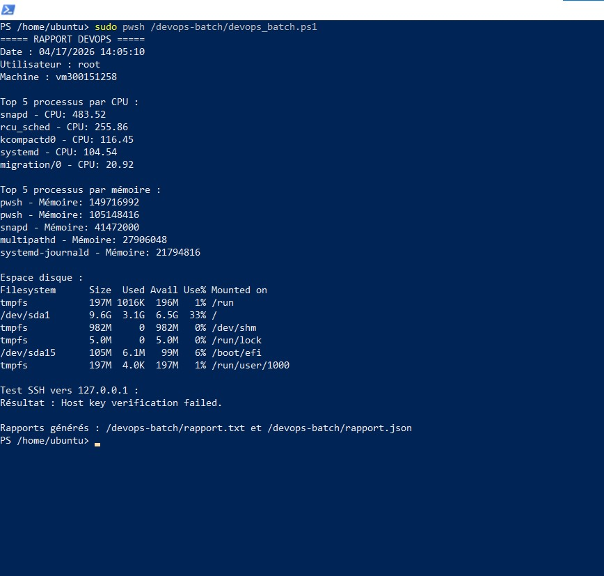
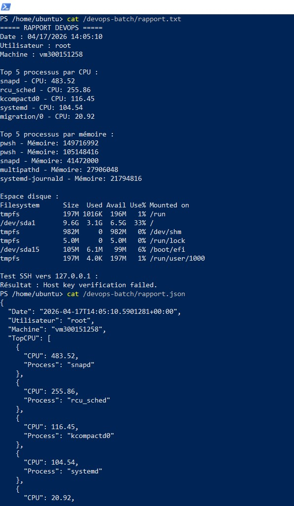

# 🧾 6.PWSH – DevOps PowerShell Script

**Étudiant : 300151258**

---

# 🎯 Objectif

Créer un script PowerShell sous Linux permettant d’automatiser des tâches DevOps et générer des rapports système.

---

# ⚙️ Fonctionnalités

Le script `devops_batch.ps1` permet de :

* analyser les processus CPU
* analyser l’utilisation mémoire
* vérifier l’espace disque
* tester la connectivité SSH
* générer un rapport `.txt` et `.json`

---

# 🚀 Exécution du script

```bash
sudo pwsh /devops-batch/devops_batch.ps1
```

---

# 📸 Résultats

## 🖥️ Exécution du script



👉 Cette image montre :

* l’exécution du script
* les processus CPU et mémoire
* les informations système
* la génération des rapports

---

## 📄 Contenu des rapports



👉 Cette image montre :

* le contenu du fichier `rapport.txt`
* le contenu du fichier `rapport.json`
* les données système générées

---

# 🧠 Conclusion

Ce TP m’a permis de :

* utiliser PowerShell sous Linux
* automatiser des tâches système
* générer des rapports exploitables en DevOps

---

# ✅ Résultat final

✔ Script fonctionnel
✔ Rapport texte généré
✔ Rapport JSON généré
✔ Intégration GitHub réussie

