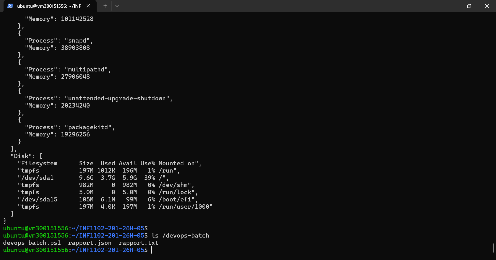
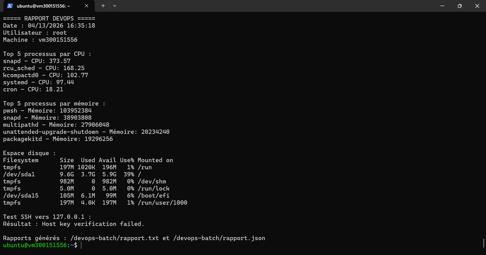

# TP PowerShell - INF1102

## Informations
- Nom : Kika
- Numéro Boréal : 300151556
- Cours : INF1102 - Programmation de systèmes

## Description du projet
Ce travail consiste à créer un script PowerShell sur Ubuntu 22.04 afin de :
- vérifier les processus utilisant le CPU
- vérifier les processus utilisant la mémoire
- vérifier l’espace disque
- tester la connexion SSH locale vers `127.0.0.1`
- générer un rapport texte `rapport.txt`
- générer un rapport JSON `rapport.json`

Le script principal utilisé est :

`/devops-batch/devops_batch.ps1`

## Étapes réalisées
1. Connexion à la machine virtuelle Ubuntu
2. Installation de PowerShell (`pwsh`)
3. Création du dossier `/devops-batch`
4. Création du script `devops_batch.ps1`
5. Exécution du script
6. Génération de :
   - `/devops-batch/rapport.txt`
   - `/devops-batch/rapport.json`
7. Test et configuration de SSH local

## Résultats

### 1. Exécution du script et fichiers générés


### 2. Contenu du rapport texte


## Résultat du test SSH
Le test SSH a été effectué vers `127.0.0.1`.

Si la clé SSH est déjà acceptée, le script retourne `OK`.
Sinon, il peut afficher un message de vérification de clé lors de la première exécution.

## Structure du dossier
```text
300151556/
├── README.md
├── devops_batch.ps1
└── images/
    ├── 6.png
    └── 6-2.png
