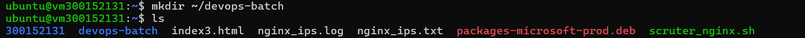
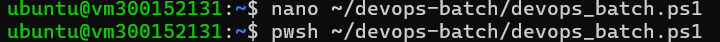
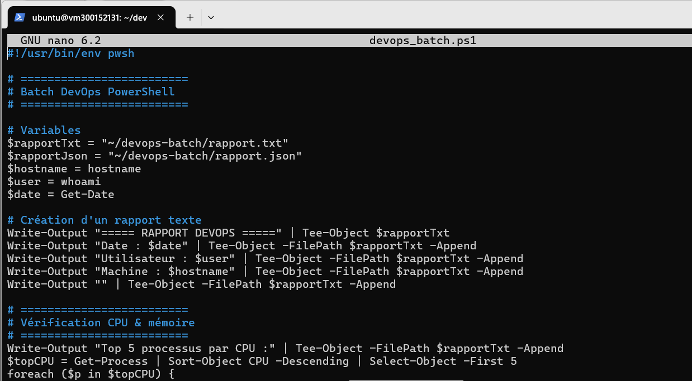
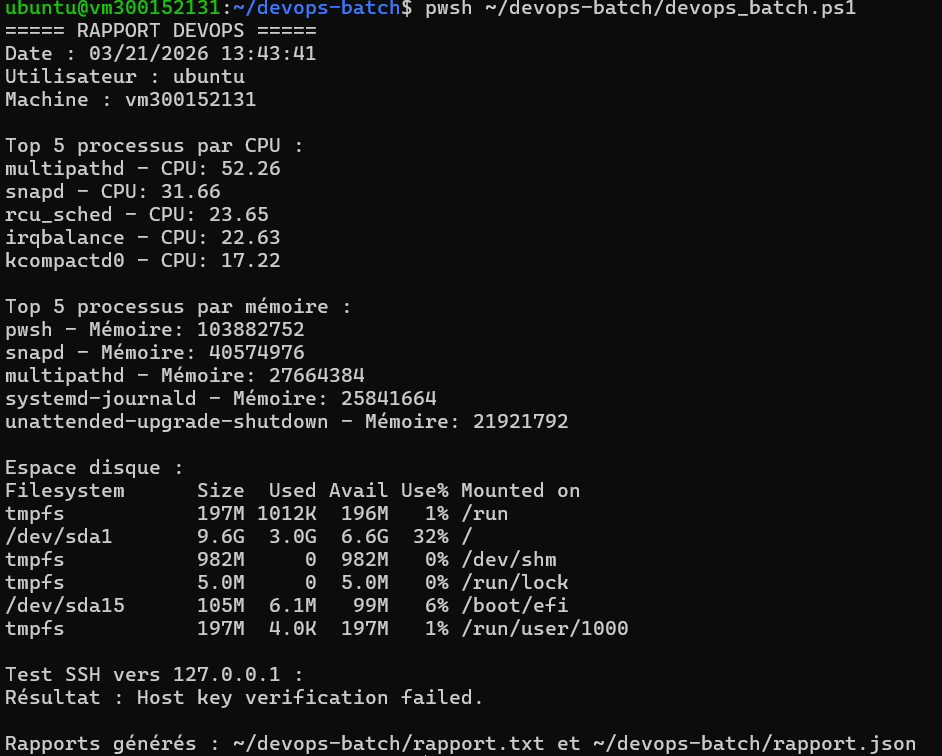

# 🧪 Laboratoire — Créer un batch DevOps PowerShell by #Calvin 300152131 

> **Cours : Programmation des Systèmes**  
> **Durée :** 90 à 120 minutes  
> **Environnement :** Ubuntu 22.04 (Jammy)  
> **Shell :** PowerShell (`pwsh`)

---

## 📋 Table des matières

1. [Objectifs](#objectifs)
2. [Partie 1 – Préparation de l'environnement](#partie-1--préparation-de-lenvironnement)
3. [Partie 2 – Créer le script principal](#partie-2--créer-le-script-principal)
4. [Partie 3 – Script complet](#partie-3--script-complet)
5. [Partie 4 – Exécuter le batch](#partie-4--exécuter-le-batch)
6. [Structure finale du TP](#structure-finale-du-tp)

---

## ⭕ Objectifs

À la fin de ce laboratoire, l'étudiant sera capable de :

- ✔️ Créer un script batch PowerShell pour Linux
- ✔️ Vérifier l'état du système (CPU, mémoire, disque)
- ✔️ Vérifier la connectivité réseau (SSH)
- ✔️ Générer un rapport texte et JSON
- ✔️ Automatiser des tâches administratives et DevOps
- ✔️ Comprendre le pipeline PowerShell orienté objets

---

## 🔹 Partie 1 – Préparation de l'environnement

Créer le dossier du TP :

```bash
mkdir ~/devops-batch
```

### 📸 Capture – Création du dossier TP



---

## 🔹 Partie 2 – Créer le script principal

Créer le fichier `devops_batch.ps1` :

```bash
nano ~/devops-batch/devops_batch.ps1
```

Ajouter le shebang pour Linux :

```bash
#!/usr/bin/env pwsh
```

### 📸 Capture – Création du script



---

## 🔹 Partie 3 – Script complet

### 📄 Code complet à intégrer

```powershell
#!/usr/bin/env pwsh

# =========================
# Batch DevOps PowerShell
# =========================

# Variables
$rapportTxt = "~/devops-batch/rapport.txt"
$rapportJson = "~/devops-batch/rapport.json"
$hostname = hostname
$user = whoami
$date = Get-Date

# Création d'un rapport texte
Write-Output "===== RAPPORT DEVOPS =====" | Tee-Object $rapportTxt
Write-Output "Date : $date" | Tee-Object -FilePath $rapportTxt -Append
Write-Output "Utilisateur : $user" | Tee-Object -FilePath $rapportTxt -Append
Write-Output "Machine : $hostname" | Tee-Object -FilePath $rapportTxt -Append
Write-Output "" | Tee-Object -FilePath $rapportTxt -Append

# =========================
# Vérification CPU & mémoire
# =========================
Write-Output "Top 5 processus par CPU :" | Tee-Object -FilePath $rapportTxt -Append
$topCPU = Get-Process | Sort-Object CPU -Descending | Select-Object -First 5
foreach ($p in $topCPU) {
    Write-Output ("{0} - CPU: {1}" -f $p.ProcessName, $p.CPU) | Tee-Object -FilePath $rapportTxt -Append
}

Write-Output "" | Tee-Object -FilePath $rapportTxt -Append
Write-Output "Top 5 processus par mémoire :" | Tee-Object -FilePath $rapportTxt -Append
$topMem = Get-Process | Sort-Object WS -Descending | Select-Object -First 5
foreach ($p in $topMem) {
    Write-Output ("{0} - Mémoire: {1}" -f $p.ProcessName, $p.WorkingSet) | Tee-Object -FilePath $rapportTxt -Append
}

# =========================
# Vérification disque
# =========================
Write-Output "" | Tee-Object -FilePath $rapportTxt -Append
Write-Output "Espace disque :" | Tee-Object -FilePath $rapportTxt -Append
$disk = df -h
Write-Output $disk | Tee-Object -FilePath $rapportTxt -Append

# =========================
# Vérification SSH
# =========================
Write-Output "" | Tee-Object -FilePath $rapportTxt -Append
$sshHost = "127.0.0.1"
Write-Output "Test SSH vers $sshHost :" | Tee-Object -FilePath $rapportTxt -Append
try {
    $result = ssh -o BatchMode=yes -o ConnectTimeout=5 $sshHost "echo 'OK'" 2>&1
    Write-Output "Résultat : $result" | Tee-Object -FilePath $rapportTxt -Append
} catch {
    Write-Output "SSH échoué vers $sshHost" | Tee-Object -FilePath $rapportTxt -Append
}

# =========================
# Génération JSON
# =========================
$reportObj = [PSCustomObject]@{
    Date        = $date
    Utilisateur = $user
    Machine     = $hostname
    TopCPU      = $topCPU | ForEach-Object { @{Process = $_.ProcessName; CPU = $_.CPU} }
    TopMemory   = $topMem | ForEach-Object { @{Process = $_.ProcessName; Memory = $_.WorkingSet} }
    Disk        = $disk
}

$reportObj | ConvertTo-Json -Depth 5 | Set-Content $rapportJson

Write-Output ""
Write-Output "Rapports générés : $rapportTxt et $rapportJson"
```

### 📸 Capture – Script complet intégré



---

## 🔹 Partie 4 – Exécuter le batch

```bash
pwsh ~/devops-batch/devops_batch.ps1
```

### Résultat attendu

Après exécution, vous devriez obtenir :

- Affichage console avec CPU, mémoire, disque, SSH
- Création des fichiers suivants :
  - `rapport.txt`
  - `rapport.json`

### 📸 Capture – Exécution du script



---

## 🔹 Structure finale du TP

```
~/devops-batch/
│
├── devops_batch.ps1      # Script principal
├── rapport.txt           # Rapport texte généré
└── rapport.json          # Rapport JSON généré
```

---

*TP réalisé dans le cadre du cours de Programmation des Systèmes*