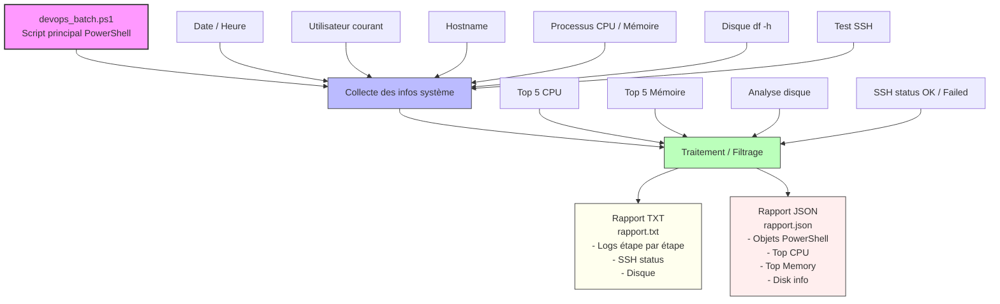

# :six: PWSH (PowerShell)

| #️⃣ | Participations | Vérifications |
|-|-|-| 
| 🥇 | [:tada: Participation](.scripts/Participation-group1.md) | [:checkered_flag: Vérification](.scripts/Check-group1.md) |
| 🥈 | [:tada: Participation](.scripts/Participation-group2.md) | [:checkered_flag: Vérification](.scripts/Check-group2.md) |


Sous **Ubuntu 22.04 (Jammy)**, le paquet **PowerShell n’est pas dans les dépôts officiels d’Ubuntu**. Il faut ajouter le **dépôt Microsoft** avant de pouvoir utiliser `apt install powershell`.

---

## :floppy_disk: Installation de PowerShell sur Ubuntu 22.04

### 1. Mettre à jour le système

```bash
sudo apt update
```

---

### 2. Installer les dépendances

```bash
sudo apt install -y wget apt-transport-https software-properties-common
```

---

### 3. Ajouter le dépôt Microsoft

Télécharger la clé du dépôt :

```bash
wget https://packages.microsoft.com/config/ubuntu/22.04/packages-microsoft-prod.deb
```

Installer le dépôt :

```bash
sudo dpkg -i packages-microsoft-prod.deb
```

---

### 4. Mettre à jour les dépôts

```bash
sudo apt update
```

---

### 5. Installer PowerShell

```bash
sudo apt install -y powershell
```

---

### 6. Lancer PowerShell

```bash
pwsh
```

Prompt :

```
PS /home/user>
```

---

### 7. Vérifier la version

Dans PowerShell :

```powershell
$PSVersionTable
```

---

### 8. Astuce utile pour lancer ton script

Pour exécuter un script :

```bash
pwsh script.ps1
```

ou

```bash
./script.ps1
```

avec le shebang :

```powershell
#!/usr/bin/env pwsh
```

---

# :test_tube: Laboratoire — Créer un batch DevOps PowerShell

Durée : **90 à 120 minutes**
Environnement : **Ubuntu 22.04 (Jammy)**
Shell : **PowerShell (pwsh)**

---

## :o: Objectifs

À la fin de ce laboratoire, l’étudiant sera capable de :

1. Créer un **script batch PowerShell** pour Linux.
2. Vérifier l’état du système (CPU, mémoire, disque).
3. Vérifier la connectivité réseau (SSH).
4. Générer un **rapport texte et JSON**.
5. Automatiser des tâches **administratives et DevOps**.
6. Comprendre le pipeline **PowerShell orienté objets**.

---
## 🔹 PARTIE 1 – Préparation de l’environnement

- [ ]  Créer le dossier du TP

```bash
sudo mkdir /devops-batch
```

---

## 🔹 PARTIE 2 – Créer le script principal

Créer le fichier `devops_batch.ps1` :

```bash
sudo nano /devops-batch/devops_batch.ps1
```

Ajouter le **shebang** pour Linux :

```powershell
#!/usr/bin/env pwsh
```

---

## 🔹 PARTIE 3 - Script complet (exemple)

📄 CODE COMPLET À INTÉGRER

```powershell
#!/usr/bin/env pwsh

# =========================
# Batch DevOps PowerShell
# =========================

# Variables
$rapportTxt = "/devops-batch/rapport.txt"
$rapportJson = "/devops-batch/rapport.json"
$hostname = hostname
$user = whoami
$date = Get-Date

# Création d'un rapport texte
Write-Output "===== RAPPORT DEVOPS =====" | Tee-Object $rapportTxt
Write-Output "Date : $date" | Tee-Object -FilePath $rapportTxt -Append
Write-Output "Utilisateur : $user" | Tee-Object -FilePath $rapportTxt -Append
Write-Output "Machine : $hostname" | Tee-Object -FilePath $rapportTxt -Append
Write-Output "" | Tee-Object -FilePath $rapportTxt -Append

# =========================
# Vérification CPU & mémoire
# =========================
Write-Output "Top 5 processus par CPU :" | Tee-Object -FilePath $rapportTxt -Append
$topCPU = Get-Process | Sort-Object CPU -Descending | Select-Object -First 5
foreach ($p in $topCPU) {
    Write-Output ("{0} - CPU: {1}" -f $p.ProcessName, $p.CPU) | Tee-Object -FilePath $rapportTxt -Append
}

Write-Output "" | Tee-Object -FilePath $rapportTxt -Append
Write-Output "Top 5 processus par mémoire :" | Tee-Object -FilePath $rapportTxt -Append
$topMem = Get-Process | Sort-Object WS -Descending | Select-Object -First 5
foreach ($p in $topMem) {
    Write-Output ("{0} - Mémoire: {1}" -f $p.ProcessName, $p.WorkingSet) | Tee-Object -FilePath $rapportTxt -Append
}

# =========================
# Vérification disque
# =========================
Write-Output "" | Tee-Object -FilePath $rapportTxt -Append
Write-Output "Espace disque :" | Tee-Object -FilePath $rapportTxt -Append
$disk = df -h
Write-Output $disk | Tee-Object -FilePath $rapportTxt -Append

# =========================
# Vérification SSH
# =========================
Write-Output "" | Tee-Object -FilePath $rapportTxt -Append
$sshHost = "127.0.0.1"
Write-Output "Test SSH vers $sshHost :" | Tee-Object -FilePath $rapportTxt -Append
try {
    $result = ssh -o BatchMode=yes -o ConnectTimeout=5 $sshHost "echo 'OK'" 2>&1
    Write-Output "Résultat : $result" | Tee-Object -FilePath $rapportTxt -Append
} catch {
    Write-Output "SSH échoué vers $sshHost" | Tee-Object -FilePath $rapportTxt -Append
}

# =========================
# Génération JSON
# =========================
$reportObj = [PSCustomObject]@{
    Date       = $date
    Utilisateur = $user
    Machine    = $hostname
    TopCPU     = $topCPU | ForEach-Object { @{Process = $_.ProcessName; CPU = $_.CPU} }
    TopMemory  = $topMem | ForEach-Object { @{Process = $_.ProcessName; Memory = $_.WorkingSet} }
    Disk       = $disk
}

$reportObj | ConvertTo-Json -Depth 5 | Set-Content $rapportJson

Write-Output ""
Write-Output "Rapports générés : $rapportTxt et $rapportJson"
```

---

## 🔹 PARTIE 4. Exécuter le batch

```bash
sudo pwsh /devops-batch/devops_batch.ps1
```

Résultat attendu :

* Affichage console avec **CPU, mémoire, disque, SSH**
* Création des fichiers :

  * `rapport.txt`
  * `rapport.json`

---

## 🔹 PARTIE 7. Structure finale du TP

```plaintext
/devops-batch/
│
├── devops_batch.ps1      # Script principal
├── rapport.txt           # Rapport texte généré
└── rapport.json          # Rapport JSON généré
```




---

:fortune_cookie: Utiliser **PowerShell sous Linux** apporte plusieurs avantages, surtout dans un contexte **administration système, DevOps ou automatisation multi-plateforme**. Voici les principaux points :

---

## 1️⃣ Automatisation multi-plateforme

* PowerShell fonctionne **sur Windows, Linux et macOS**.
* Les mêmes scripts peuvent fonctionner **sur plusieurs OS**, avec peu ou pas de modification.
* Très utile si tu gères **des serveurs mixtes** dans une entreprise (Windows + Ubuntu + RedHat, etc.).

---

## 2️⃣ Pipeline orienté objets

* Contrairement au Bash, qui travaille principalement avec du texte, PowerShell **travaille avec des objets**.
* Exemple :

```powershell
Get-Process | Where-Object {$_.CPU -gt 10} | Select-Object ProcessName, CPU
```

* Chaque commande renvoie un **objet structuré**, pas seulement des lignes de texte, ce qui facilite :

  * le filtrage (`Where-Object`)
  * la sélection (`Select-Object`)
  * l’exportation (`Export-Csv`, `ConvertTo-Json`)

---

## 3️⃣ Intégration avec les API et services

* PowerShell peut appeler **API REST**, manipuler JSON et XML facilement.
* Exemple : tu peux automatiser des tâches DevOps avec **Moodle API, Azure, AWS, Rubrik**, etc., directement depuis Linux.
* Bash demanderait beaucoup plus de parsing et de scripts supplémentaires.

---

## 4️⃣ Gestion de systèmes complexe

* PowerShell peut **accéder à des informations système avancées** : processus, services, utilisateurs, SSH, disque, réseau, etc.
* Les commandes sont souvent **plus lisibles et standardisées** qu’avec Bash, surtout pour des tâches complexes.

---

## 5️⃣ Scripts plus robustes et maintenables

* **Variables typées, fonctions, modules** : permet de structurer les scripts comme de vrais programmes.
* Plus facile de créer des **batchs DevOps complexes**, comme celui que tu as commencé à faire (`devops_batch.ps1`).

---

## 6️⃣ Interopérabilité avec Windows

* Si tu as des **scripts Windows** existants, tu peux souvent les **adapter pour Linux** sans réécrire tout en Bash.
* Très utile dans un **environnement hybride Windows/Linux**.

---

### Exemple concret :

* **Bash** : extraire les 5 processus les plus gourmands en mémoire, puis générer un JSON :

```bash
ps aux --sort=-%mem | head -n 6 | awk '{print $11, $4}' > top.txt
```

* **PowerShell** :

```powershell
Get-Process | Sort-Object WS -Descending | Select-Object -First 5 Name,WS | ConvertTo-Json
```

→ Le résultat est directement un **JSON utilisable**, prêt pour des scripts DevOps.

---

💡 **Résumé en une phrase** :

> PowerShell sous Linux combine **la puissance et la lisibilité de PowerShell Windows** avec **la flexibilité de Linux**, ce qui rend l’automatisation et le DevOps plus rapides, robustes et multi-plateforme.

---

# Comparatif Bash vs PowerShell sous Linux

| Fonctionnalité            | Bash                            | PowerShell                                                                            | Commentaire / Avantage PowerShell                                                      |
| ------------------------- | ------------------------------- | ------------------------------------------------------------------------------------- | -------------------------------------------------------------------------------------- |
| **Type de données**       | Texte (strings)                 | Objets (.NET/PSObjects)                                                               | Les objets permettent de filtrer, trier et exporter facilement sans parsing compliqué. |                                                                                            |                            |                         |                                                                      |
| **Filtrage**              | `grep` ou `awk`                 | `Where-Object {$_.CPU -gt 10}`                                                        | Plus lisible et robuste, sans découpage manuel des colonnes.                           |                                                                                            |                            |                         |                                                                      |
| **Export CSV / JSON**     | `awk ... > fichier.csv` ou `jq` | `ConvertTo-Csv` ou `ConvertTo-Json`                                                   | Prêt pour ingestion dans d’autres scripts ou API DevOps.                               |                                                                                            |                            |                         |                                                                      |
| **Boucles**               | `for i in *; do ...; done`      | `foreach ($f in Get-ChildItem) { ... }`                                               | Syntaxe plus orientée objets, accès direct aux propriétés (`$f.Name`, `$f.Length`).    |                                                                                            |                            |                         |                                                                      |
| **Variables typées**      | Pas typées, string par défaut   | Typées (`[int]$count = 5`)                                                            | Moins d’erreurs et meilleure maintenance pour scripts complexes.                       |                                                                                            |                            |                         |                                                                      |
| **Accès SSH**             | `ssh user@host "command"`       | `ssh user@host "command"` (directement dans PowerShell, intégré dans un script batch) | Peut être intégré avec variables PowerShell et gestion automatique des erreurs.        |                                                                                            |                            |                         |                                                                      |
| **Gestion fichiers**      | `cp, mv, rm, tar`               | `Copy-Item, Move-Item, Remove-Item, Compress-Archive`                                 | Commandes plus cohérentes et cross-platform.                                           |                                                                                            |                            |                         |                                                                      |
| **Automatisation DevOps** | Scripts multiples + parsing     | Scripts uniques orientés objets + modules                                             | PowerShell facilite intégration API, JSON, Azure, AWS, etc.                            |                                                                                            |                            |                         |                                                                      |
| **Multi-plateforme**      | Limité, Bash Linux/macOS        | Linux + Windows + macOS                                                               | Les mêmes scripts fonctionnent sur plusieurs OS sans réécriture majeure.               |                                                                                            |                            |                         |                                                                      |

---

### Exemple concret : générer un rapport DevOps

**Bash** :

```bash
ps aux --sort=-%mem | head -n 5 > top_mem.txt
df -h >> top_mem.txt
```

**PowerShell** :

```powershell
$report = [PSCustomObject]@{
    TopMemory = Get-Process | Sort-Object WS -Descending | Select-Object -First 5 Name,WS
    Disk      = df -h
}
$report | ConvertTo-Json | Set-Content report.json
```

✅ Résultat : un **JSON prêt pour ingestion**, pas besoin de parsing.

