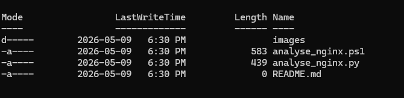
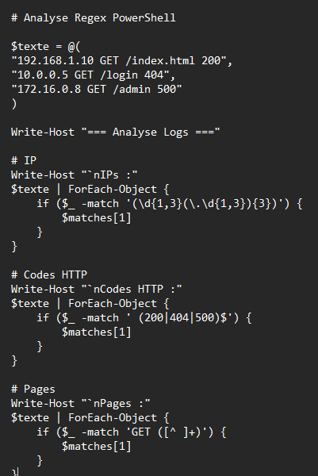
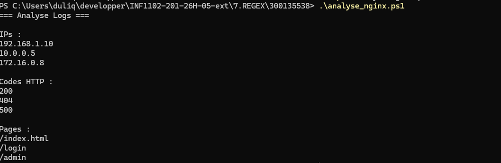
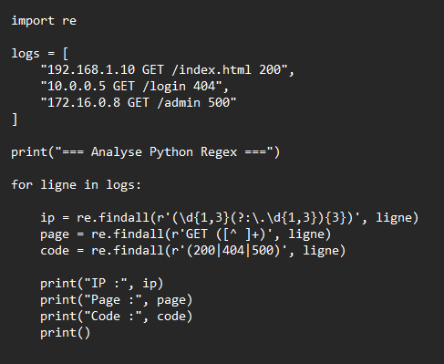
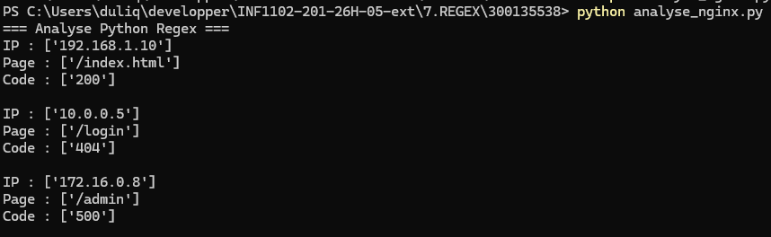

# 🧪 TP7 — Expressions Régulières (Regex)

## 👤 Informations étudiant

| Champ | Détails |
|---|---|
| Nom | Mohamed Reda El Youssoufi |
| Matricule | 300135538 |
| Travail | TP7 — REGEX |
| Technologies | PowerShell / Python |
| Sujet | Analyse de logs avec Regex |

---

# 🎯 Objectif

Ce TP permet de pratiquer les expressions régulières (Regex) avec :

- PowerShell
- Python
- Analyse de logs
- Extraction d’informations
- Traitement de texte

---

# 📁 Structure du projet

```text
7.REGEX/
└── 300135538/
    ├── README.md
    ├── analyse_nginx.ps1
    ├── analyse_nginx.py
    └── images/
        ├── structure.png
        ├── powershell-script.png
        ├── powershell-execution.png
        ├── python-script.png
        └── python-execution.png
```

---

# ⚡ Script PowerShell

## Exécution

```powershell
.\analyse_nginx.ps1
```

---

# 🐍 Script Python

## Exécution

```powershell
python analyse_nginx.py
```

---

# 📸 Captures d’écran

## Structure du projet



---

## Script PowerShell



---

## Exécution PowerShell



---

## Script Python



---

## Exécution Python



---

# ✅ Résultat

Le TP a permis :

- ✔ Utilisation des Regex
- ✔ Analyse des logs
- ✔ Extraction des IP
- ✔ Extraction des pages GET
- ✔ Analyse des codes HTTP
- ✔ Utilisation de PowerShell
- ✔ Utilisation de Python

---

# 📚 Concepts Regex utilisés

| Regex | Description |
|---|---|
| `\d` | chiffre |
| `+` | une ou plusieurs répétitions |
| `*` | zéro ou plusieurs |
| `()` | groupe |
| `[^ ]+` | texte sans espace |
| `\.` | point littéral |

---

# 🧠 Exemple de Regex

## IP

```regex
(\d{1,3}(\.\d{1,3}){3})
```

## Pages GET

```regex
GET ([^ ]+)
```

## Codes HTTP

```regex
(200|404|500)
```
