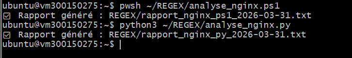
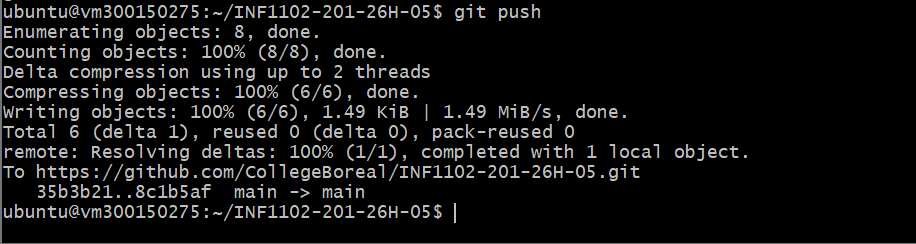

# Expressions Régulières — Analyse des logs Nginx 📊

**Cours** : INF1102-201-26H-05  
**Étudiant** : Tarik Tidjet  
**Matricule** : 300150275  
**Date** : 2026-03-31  

---

## 📋 Description

Ce travail pratique consiste à analyser les logs du serveur web Nginx à l'aide d'expressions régulières (Regex), en utilisant deux langages de script : PowerShell et Python. Les scripts génèrent automatiquement un rapport détaillé contenant les statistiques des requêtes HTTP.

---

## 🖥️ 1. Connexion SSH à la VM

Connexion sécurisée à la machine virtuelle `vm300150275` via SSH à l'adresse `10.7.237.231`.
```bash
ssh -i ~/.ssh/ma_cle \
  -o StrictHostKeyChecking=no \
  -o UserKnownHostsFile=/tmp/ssh_known_hosts_empty \
  ubuntu@10.7.237.231
```


---

## 📁 2. Structure du projet

Création de la structure de dossiers et vérification de la présence des logs Nginx.
```bash
mkdir -p ~/REGEX/images
ls /var/log/nginx/
```


---

## ⚡ 3. Scripts d'analyse

### Script PowerShell — `analyse_nginx.ps1`

Analyse le fichier `/var/log/nginx/access.log` à l'aide d'expressions régulières PowerShell et génère un rapport texte contenant :
- Le nombre total de requêtes
- Les erreurs HTTP (4xx et 5xx)
- Le top 5 des adresses IP
- Le top 5 des pages visitées

### Script Python — `analyse_nginx.py`

Même analyse réalisée avec le module `re` de Python et la classe `Counter` pour le classement des résultats.



---

## 🚀 4. Déploiement sur GitHub

Envoi des fichiers sur le dépôt GitHub du cours via `git push`.
```bash
git add 7.REGEX/300150275/
git commit -m "Ajout scripts REGEX - 300150275"
git push
```



---

## 🧠 Expressions régulières utilisées

| Élément | Regex |
|---|---|
| Adresse IP | `(\d{1,3}\.){3}\d{1,3}` |
| Code HTTP | `" (\d{3}) "` |
| Page GET | `"GET ([^ ]+)` |
| Erreurs 4xx/5xx | `^[45]` |

---

## ✅ Résultat

Les deux scripts s'exécutent correctement et génèrent les rapports suivants :
- `rapport_nginx_ps1_2026-03-31.txt`
- `rapport_nginx_py_2026-03-31.txt`
