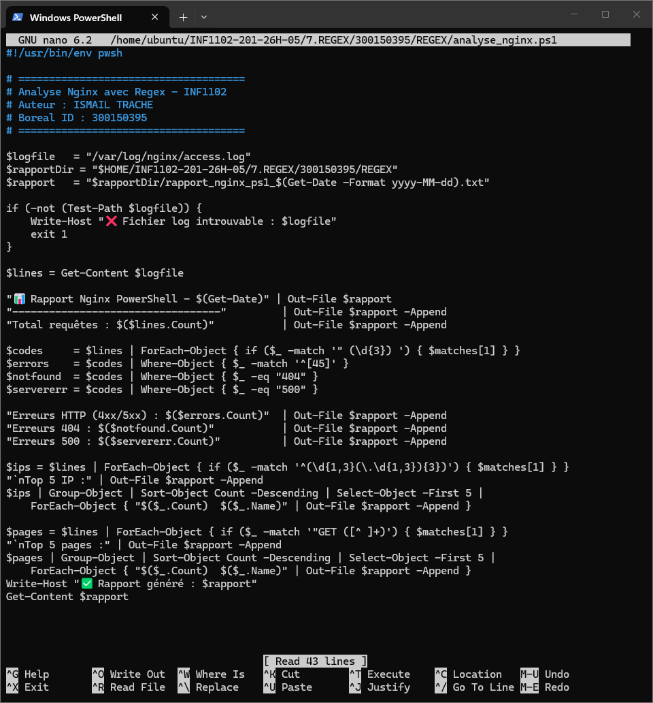
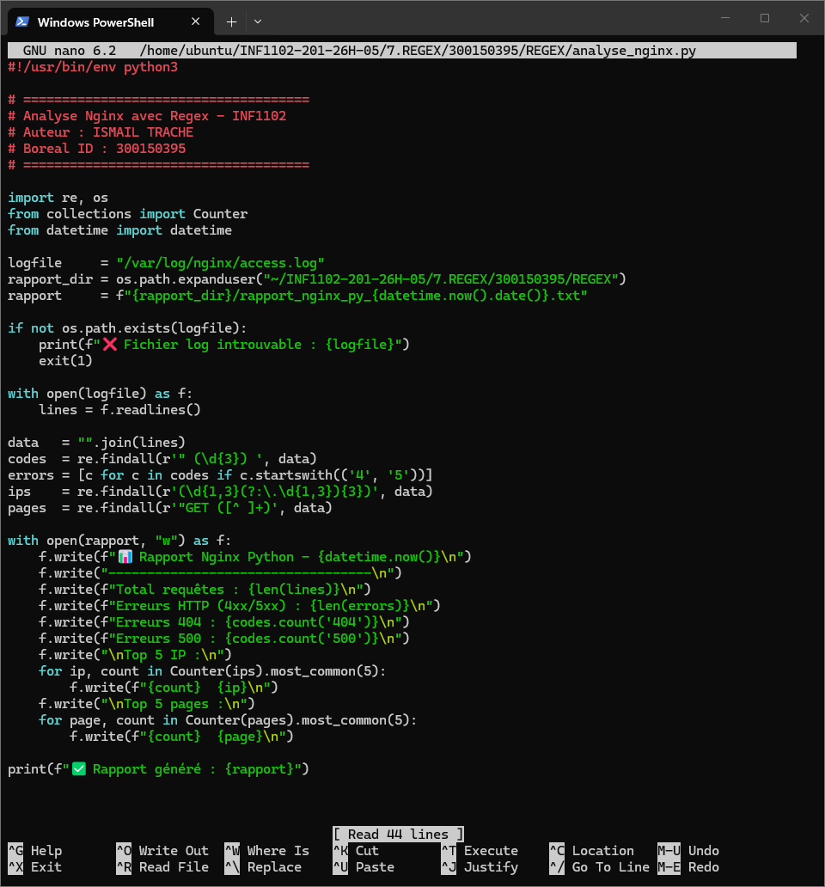
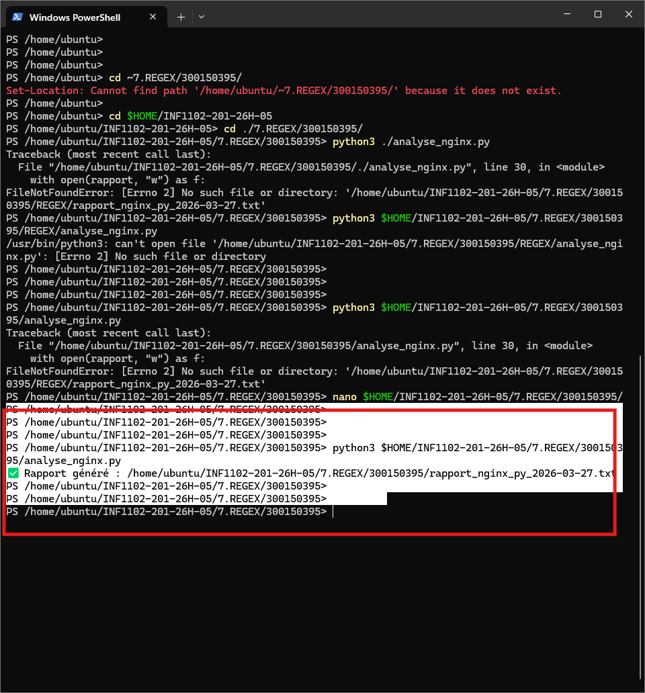
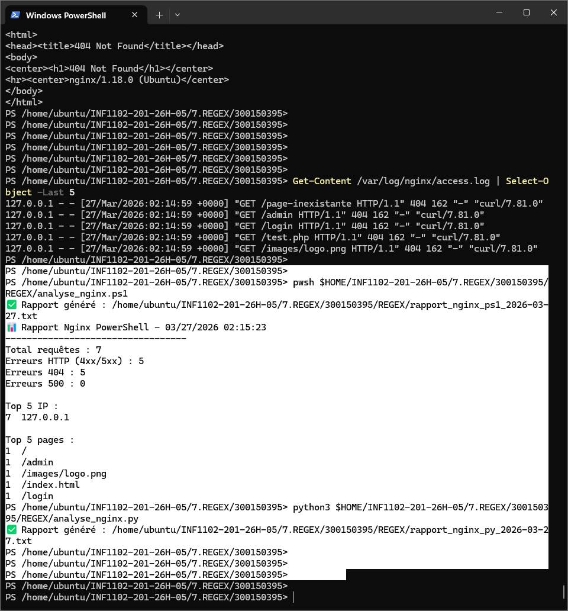

# 7️⃣ REGEX — Analyse des logs Nginx avec Expressions Régulières

**Nom :** Ismail Trache
**Boréal ID :** 300150395
**Cours :** INF1102
**Environnement :** Ubuntu 22.04 LTS
**Shells :** PowerShell (pwsh) + Python 3

---

# 1. Introduction

Dans ce laboratoire, l'objectif est d'utiliser des **expressions régulières (Regex)** pour analyser les logs du serveur web **Nginx**.

Les scripts développés permettent de :

- Lire le fichier `/var/log/nginx/access.log`
- Extraire les **codes HTTP** (200, 404, 500...)
- Identifier les **Top 5 adresses IP**
- Identifier les **Top 5 pages visitées**
- Générer un **rapport texte automatique**

---

# 2. Structure du projet

```plaintext
7.REGEX/300150395/
│
├── analyse_nginx.ps1                    # Script PowerShell
├── analyse_nginx.py                     # Script Python
├── rapport_nginx_ps1_2026-03-27.txt     # Rapport généré PowerShell
├── rapport_nginx_py_2026-03-27.txt      # Rapport généré Python
├── README.md                            # Ce fichier
└── images/
    ├── 1.png    # Script analyse_nginx.ps1 dans nano
    ├── 2.png    # Script analyse_nginx.py dans nano
    ├── 3.png    # Exécution des deux scripts
    └── 4.png    # Contenu du rapport généré
```

---

# 3. Format du log Nginx

```text
127.0.0.1 - - [27/Mar/2026:02:14:59 +0000] "GET /index.html HTTP/1.1" 200 162 "-" "curl/7.81.0"
```

---

# 4. Regex utilisées

| Élément | Regex |
|---|---|
| Adresse IP | `(\d{1,3}(\.\d{1,3}){3})` |
| Code HTTP | `" (\d{3}) "` |
| Pages GET | `"GET ([^ ]+)` |
| Erreurs 4xx/5xx | `^[45]` |

---

# 5. Script PowerShell — analyse_nginx.ps1



```powershell
#!/usr/bin/env pwsh

# =====================================
# Analyse Nginx avec Regex - INF1102
# Auteur : ISMAIL TRACHE
# Boreal ID : 300150395
# =====================================

$logfile    = "/var/log/nginx/access.log"
$rapportDir = "$HOME/INF1102-201-26H-05/7.REGEX/300150395"
$rapport    = "$rapportDir/rapport_nginx_ps1_$(Get-Date -Format yyyy-MM-dd).txt"

if (-not (Test-Path $logfile)) {
    Write-Host "❌ Fichier log introuvable : $logfile"
    exit 1
}

$lines = Get-Content $logfile

"📊 Rapport Nginx PowerShell - $(Get-Date)" | Out-File $rapport
"----------------------------------"         | Out-File $rapport -Append
"Total requêtes : $($lines.Count)"           | Out-File $rapport -Append

$codes     = $lines | ForEach-Object { if ($_ -match '" (\d{3}) ') { $matches[1] } }
$errors    = $codes | Where-Object { $_ -match '^' }
$notfound  = $codes | Where-Object { $_ -eq "404" }
$servererr = $codes | Where-Object { $_ -eq "500" }

"Erreurs HTTP (4xx/5xx) : $($errors.Count)"  | Out-File $rapport -Append
"Erreurs 404 : $($notfound.Count)"           | Out-File $rapport -Append
"Erreurs 500 : $($servererr.Count)"          | Out-File $rapport -Append

$ips = $lines | ForEach-Object { if ($_ -match '^(\d{1,3}(\.\d{1,3}){3})') { $matches[1] } }
"`nTop 5 IP :" | Out-File $rapport -Append
$ips | Group-Object | Sort-Object Count -Descending | Select-Object -First 5 |
    ForEach-Object { "$($_.Count)  $($_.Name)" | Out-File $rapport -Append }

$pages = $lines | ForEach-Object { if ($_ -match '"GET ([^ ]+)') { $matches[1] } }
"`nTop 5 pages :" | Out-File $rapport -Append
$pages | Group-Object | Sort-Object Count -Descending | Select-Object -First 5 |
    ForEach-Object { "$($_.Count)  $($_.Name)" | Out-File $rapport -Append }

Write-Host "✅ Rapport généré : $rapport"
Get-Content $rapport
```

---

# 6. Script Python — analyse_nginx.py



```python
#!/usr/bin/env python3

# =====================================
# Analyse Nginx avec Regex - INF1102
# Auteur : ISMAIL TRACHE
# Boreal ID : 300150395
# =====================================

import re, os
from collections import Counter
from datetime import datetime

logfile     = "/var/log/nginx/access.log"
rapport_dir = os.path.expanduser("~/INF1102-201-26H-05/7.REGEX/300150395")
rapport     = f"{rapport_dir}/rapport_nginx_py_{datetime.now().date()}.txt"

if not os.path.exists(logfile):
    print(f"❌ Fichier log introuvable : {logfile}")
    exit(1)

with open(logfile) as f:
    lines = f.readlines()

data   = "".join(lines)
codes  = re.findall(r'" (\d{3}) ', data)
errors = [c for c in codes if c.startswith(('4', '5'))]
ips    = re.findall(r'(\d{1,3}(?:\.\d{1,3}){3})', data)
pages  = re.findall(r'"GET ([^ ]+)', data)

with open(rapport, "w") as f:
    f.write(f"📊 Rapport Nginx Python - {datetime.now()}\n")
    f.write("----------------------------------\n")
    f.write(f"Total requêtes : {len(lines)}\n")
    f.write(f"Erreurs HTTP (4xx/5xx) : {len(errors)}\n")
    f.write(f"Erreurs 404 : {codes.count('404')}\n")
    f.write(f"Erreurs 500 : {codes.count('500')}\n")
    f.write("\nTop 5 IP :\n")
    for ip, count in Counter(ips).most_common(5):
        f.write(f"{count}  {ip}\n")
    f.write("\nTop 5 pages :\n")
    for page, count in Counter(pages).most_common(5):
        f.write(f"{count}  {page}\n")

print(f"✅ Rapport généré : {rapport}")
```

---

# 7. Exécution des scripts

```powershell
# PowerShell
pwsh ./analyse_nginx.ps1

# Python
python3 ./analyse_nginx.py
```



---

# 8. Résultat obtenu

```
📊 Rapport Nginx PowerShell - 03/27/2026 02:15:23
----------------------------------
Total requêtes : 7
Erreurs HTTP (4xx/5xx) : 5
Erreurs 404 : 5
Erreurs 500 : 0

Top 5 IP :
7  127.0.0.1

Top 5 pages :
1  /
1  /admin
1  /images/logo.png
1  /index.html
1  /login
```



---

# 9. Automatisation avec Cron

```bash
crontab -e
```

```bash
0 2 * * * /usr/bin/pwsh /home/ubuntu/INF1102-201-26H-05/7.REGEX/300150395/analyse_nginx.ps1
5 2 * * * /usr/bin/python3 /home/ubuntu/INF1102-201-26H-05/7.REGEX/300150395/analyse_nginx.py
```

---

# 10. Comparatif Bash / PowerShell / Python

| Action | Bash | PowerShell | Python |
|---|---|---|---|
| Chercher un mot | `grep "mot" fichier` | `Select-String -Pattern "mot"` | `re.search(r"mot", texte)` |
| Extraire IP | `grep -oE "\d{1,3}(\.\d{1,3}){3}"` | `-match "(\d{1,3}\.){3}\d{1,3}"` | `re.findall(r"\d{1,3}(?:\.\d{1,3}){3}", data)` |
| Codes HTTP | `grep -oP '" \K\d{3}'` | `-match '" (\d{3}) '` | `re.findall(r'" (\d{3}) ', data)` |
| Supprimer lignes vides | `grep -v "^\s*$"` | `Where-Object { $_ -notmatch "^\s*$" }` | `[l for l in f if l.strip()]` |

---

:fortune_cookie: **Conclusion** : Les expressions régulières permettent d'extraire rapidement des informations précises depuis des fichiers de logs volumineux, que ce soit en PowerShell ou Python — les deux approches produisent le même résultat avec des syntaxes légèrement différentes.
