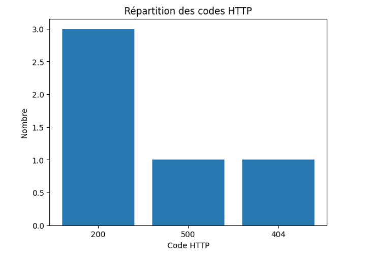
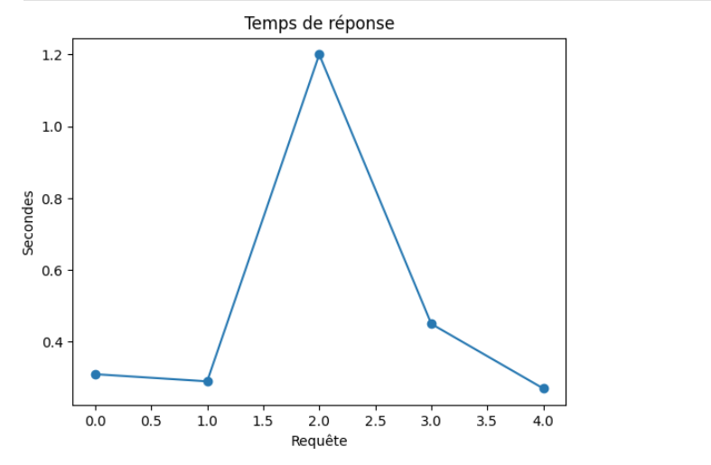
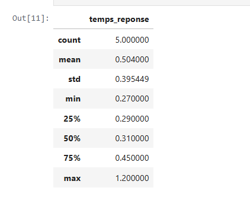

# 📊 Monitoring Web & Analyse des performances Nginx

## 👤 Étudiant
- **Nom :** Haroune Derkani  
- **ID Boréal :** 300141570  
- **Cours :** INF1102 — Programmation de systèmes  

---

## 🎯 Objectif du projet

Ce projet consiste à analyser un fichier de logs Nginx afin d’évaluer l’état et les performances d’un site web.

L’analyse permet de :
- compter le nombre total de requêtes
- identifier les erreurs HTTP importantes
- mesurer les temps de réponse
- visualiser les performances avec des graphiques
- produire un rapport exploitable dans un contexte DevOps

---


Ce graphique montre la répartition des codes HTTP...



Ce graphique montre les temps de réponse...


## 📁 Structure du projet

```text
300141570/
├── scripts/
│   ├── analyse.sh
│   ├── analyse.py
│   └── requirements.txt
├── data/
│   └── access.log
├── output/
│   └── rapport.txt
├── images/
│   ├── 1.png
│   ├── 2.png
│   └── 3.png
├── RAPPORT.ipynb
└── README.md
⚙️ Technologies utilisées
Bash pour l’exécution du script principal
Python pour le traitement des données
Pandas pour les statistiques descriptives
Matplotlib pour les visualisations graphiques
Jupyter Notebook pour le rapport analytique
▶️ Exécution du projet
Exécuter le script principal
bash scripts/analyse.sh
Exécuter le script Python seul
python3 scripts/analyse.py data/access.log
📄 Rapport généré

Le projet génère automatiquement le fichier :

output/rapport.txt

Ce rapport contient :

le nombre total de requêtes
le nombre total d’erreurs HTTP
les erreurs 404
les erreurs 500
le temps de réponse moyen
un résumé des codes HTTP observés
📓 Analyse dans le notebook

Le fichier RAPPORT.ipynb présente une analyse plus détaillée des logs.

Le notebook inclut :

le chargement du fichier access.log
la vérification du nombre total de requêtes
l’analyse des erreurs HTTP
la visualisation graphique des codes HTTP
la visualisation des temps de réponse
les statistiques descriptives avec Pandas
une conclusion sur l’état du site
📸 Résultats obtenus
🔹 Répartition des codes HTTP

Ce graphique montre la fréquence des codes HTTP observés dans le fichier log.
On constate que la majorité des requêtes retournent un code 200, avec quelques erreurs 404 et 500.

🔹 Temps de réponse

Ce graphique représente l’évolution des temps de réponse des requêtes.
Il permet d’identifier rapidement si certaines requêtes sont plus lentes que les autres.

🔹 Statistiques descriptives

Le tableau statistique résume les principales mesures sur les temps de réponse :

nombre total de requêtes
moyenne
écart-type
minimum
quartiles
maximum
🧠 Analyse des résultats

L’étude du fichier log montre que :

le site répond correctement dans la majorité des cas
les erreurs HTTP restent limitées
certaines requêtes sont nettement plus lentes que les autres
l’analyse graphique facilite la détection rapide des anomalies

Ce type d’approche est particulièrement utile en DevOps, en administration système et en cybersécurité, car elle permet de transformer des logs bruts en indicateurs clairs et exploitables.

✅ Conclusion

Ce projet montre comment les logs Nginx peuvent être utilisés pour surveiller un site web, mesurer ses performances et détecter rapidement les problèmes.

Grâce à l’utilisation combinée de Bash, Python, Pandas, Matplotlib et Jupyter Notebook, il est possible de produire un rapport complet, structuré et professionnel à partir de données simples.
