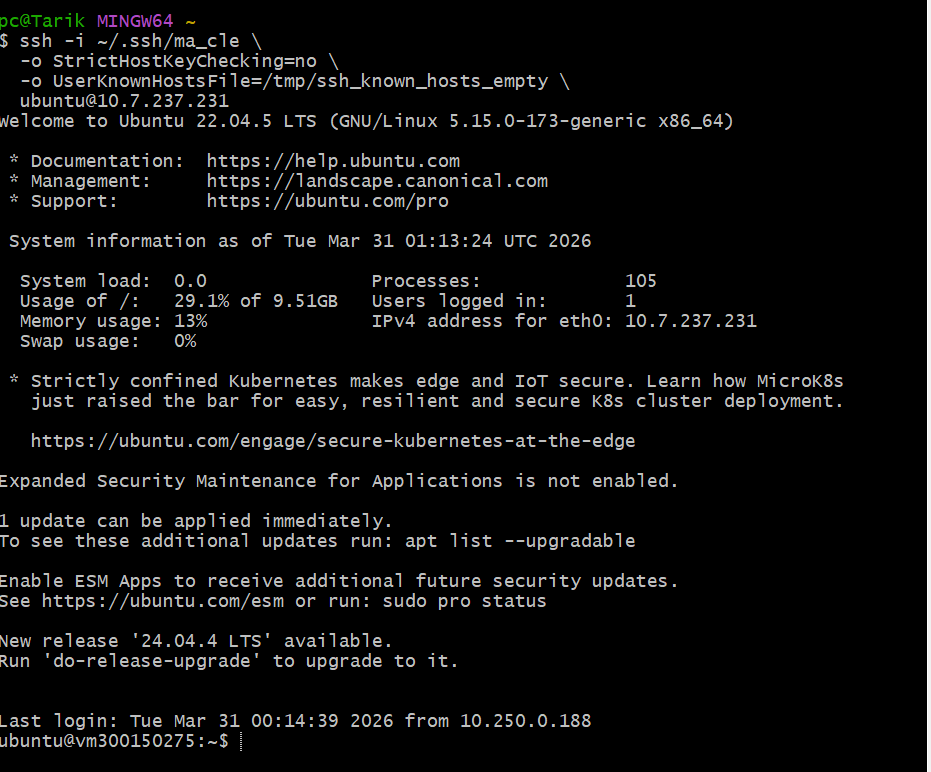
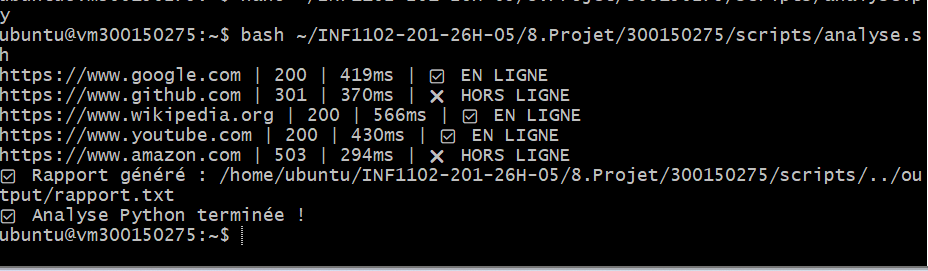
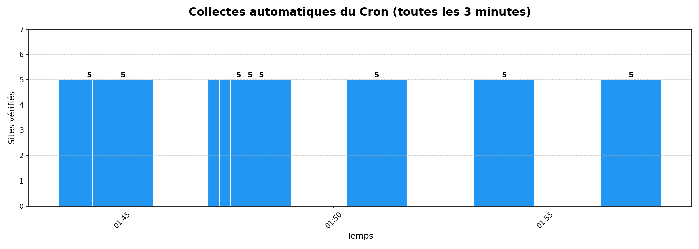
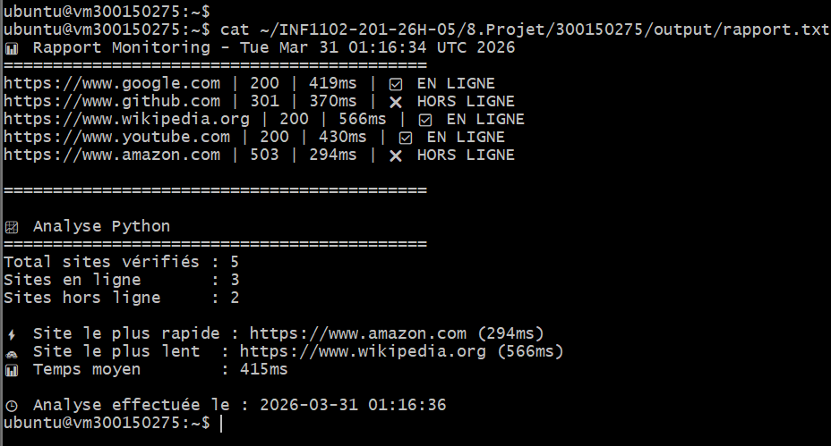
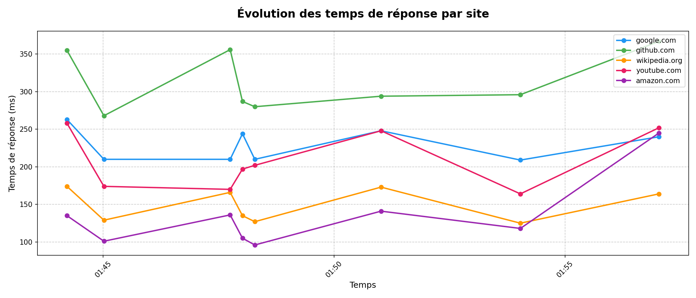

# Projet 5 : Monitoring de sites web 🌐

**Cours** : INF1102-201-26H-05  
**Étudiant** : Tarik Tidjet  
**Matricule** : 300150275  
**Date** : 2026-03-31  

---

## 📋 Description

Ce projet surveille automatiquement la disponibilité et le temps de réponse de 5 sites web toutes les **3 minutes** via un cron job. Les données sont collectées en CSV, analysées avec Python et visualisées avec matplotlib.

---

## 📁 Structure du projet
```
300150275/
├── scripts/
│   ├── analyse.sh       # Script Bash principal
│   └── analyse.py       # Script Python de collecte
├── data/
│   └── monitoring.csv   # Données collectées automatiquement
├── output/
│   ├── rapport.txt               # Rapport texte
│   ├── graphique_evolution.png   # Évolution des temps de réponse
│   └── graphique_cron.png        # Preuve du fonctionnement du cron
├── images/              # Captures d'écran
├── RAPPORT.ipynb        # Rapport Jupyter avec visualisations
└── README.md            # Ce fichier
```

---

## 🖥️ 1. Connexion SSH
```bash
ssh -i ~/.ssh/ma_cle \
  -o StrictHostKeyChecking=no \
  -o UserKnownHostsFile=/tmp/ssh_known_hosts_empty \
  ubuntu@10.7.237.231
```



---

## ▶️ 2. Exécution des scripts
```bash
bash scripts/analyse.sh
```



---

## ⏰ 3. Automatisation avec Cron

Le script s'exécute automatiquement toutes les **3 minutes** grâce au cron :
```bash
*/3 * * * * bash /home/ubuntu/INF1102-201-26H-05/8.Project/300150275/scripts/analyse.sh
```



---

## 📊 4. Rapport généré



---

## 📈 5. Évolution des temps de réponse



---

## 🚀 6. Push sur GitHub


---

## 🌐 Sites surveillés

| Site | Description |
|------|-------------|
| google.com | Moteur de recherche |
| github.com | Plateforme de code |
| wikipedia.org | Encyclopédie en ligne |
| youtube.com | Plateforme vidéo |
| amazon.com | E-commerce |

---

## 🔧 Dépendances

- Python 3.8+
- Modules : `pandas`, `matplotlib`, `urllib`
- Cron (Linux)
- Jupyter Notebook
