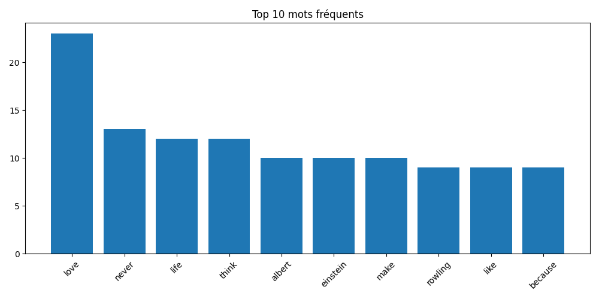
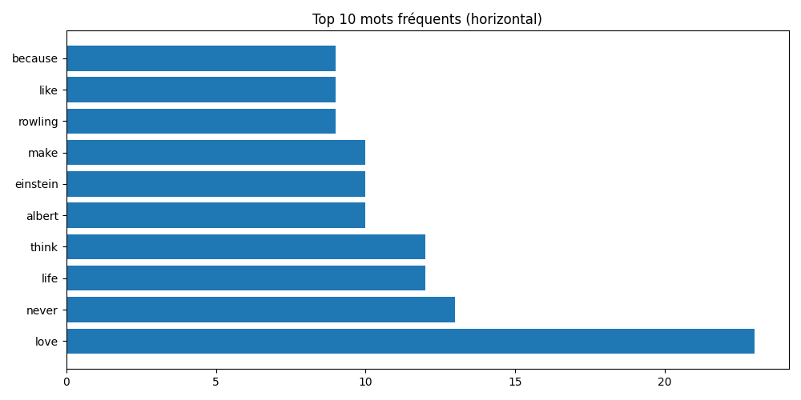
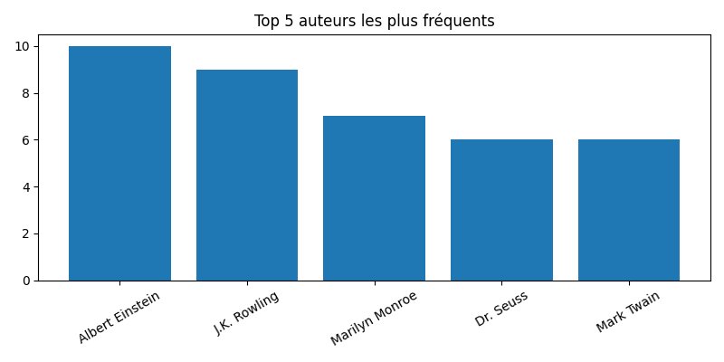

*# 🚀 Scrapy News — Projet INF1102 Programmation Système
**Étudiant** : Ismail Trache (300150395)  
**Cours** : INF1102 — Programmation système  
**Environnement** : Ubuntu 22.04 LTS  
**Date** : 2026-04-10
 


---
 
## 📋 Table des matières
- [Présentation étudiant](#-présentation-étudiant)
- [Projet principal — Scrapy News](#-projet-principal--scrapy-news)
- [Installation](#-installation)
- [Exécution](#-exécution)
- [Résultats](#-résultats)
- [Structure du projet](#-structure-du-projet)
- [Projets complémentaires](#-projets-complémentaires)
 
---
 
## 👤 Présentation étudiant
 
| **Champ** | **Valeur** |
|-----------|-----------|
| **Nom complet** | Ismail Trache |
| **Identifiant** | 300150395 |
| **Cours** | INF1102 — Programmation système |
| **Environnement** | Ubuntu 22.04 LTS |
| **Langue** | Python 3, Bash, PowerShell |
 
---
 
## 📰 Projet principal — Scrapy News
 
### Objectif
Ce projet implémente une **chaîne complète de scraping et d'analyse textuelle** :
 
1. **Scraping** : utilise le framework **Scrapy** pour extraire 100 citations du site de démonstration [`https://quotes.toscrape.com`](https://quotes.toscrape.com)
2. **Stockage** : les données brutes sont sauvegardées en format **JSONL** (`data/articles.jsonl`)
3. **Analyse** : un script **Python** effectue une analyse statistique des mots les plus fréquents
4. **Visualisation** : génération d'un **histogramme** et d'un **wordcloud** pour présenter les résultats
5. **Documentation** : rapport Jupyter **RAPPORT.ipynb** avec analyses écrites et figures intégrées
 
**Livrables conformes au cours** :
- ✅ `scripts/analyse.ps1` — Script PowerShell principal
- ✅ `scripts/analyse.py` — Script d'analyse Python
- ✅ `output/rapport.txt` — Rapport texte généré
- ✅ `RAPPORT.ipynb` — Rapport Jupyter avec visualisations
- ✅ `data/articles.jsonl` — Données brutes (JSONL)
 
---
 
## 📦 Installation
 
### Prérequis
- Python 3.8+
- pip ou pipenv
- PowerShell (pour `scripts/analyse.ps1`)
 
### Étapes
 
Depuis la racine du projet (`8.Project/300150395/`) :
 
```bash
# 1. Créer un environnement virtuel
python3 -m venv venv
source venv/bin/activate  # Linux/macOS
# ou
venv\Scripts\activate     # Windows
 
# 2. Installer les dépendances
pip install -r requirements.txt
```
 
**Dépendances** (`requirements.txt`) :
```
scrapy>=2.8
matplotlib>=3.7
numpy>=1.24
wordcloud>=1.9
pillow>=9.0
notebook>=6.5
pandas>=1.5
```
 
---
 
## 🚀 Exécution
 
### Méthode 1 : Script PowerShell (recommandé)
 
Le script `scripts/analyse.ps1` automatise la **totalité du pipeline** :
 
```bash
pwsh ./scripts/analyse.ps1
```
 
**Étapes exécutées automatiquement** :
1. Scraping avec Scrapy → `data/articles.jsonl`
2. Analyse Python → `output/rapport.txt`, `output/top_words.png`, `output/wordcloud.png`
3. Génération du rapport Jupyter → `RAPPORT.ipynb`
 
### Méthode 2 : Étape par étape
 
```bash
# 1) Scraping avec Scrapy
scrapy runspider scripts/news_spider.py -O data/articles.jsonl
 
# 2) Analyse et visualisation
python scripts/analyse.py data/articles.jsonl
 
# 3) Ouvrir le rapport Jupyter (optionnel)
jupyter notebook RAPPORT.ipynb
```
 
---
 
## 📊 Résultats
 
### Exemple d'exécution
 
Après exécution, le fichier `output/rapport.txt` contient :
 
```
=================================================
        RAPPORT SCRAPY NEWS — ANALYSE TEXTUELLE
=================================================
📅 Date : 2026-04-10
⏱️  Heures : 23h03
 
Nombre total de citations scrapées : 100
 
━━━━━━━━━━━━━━━━━━━━━━━━━━━━━━━━━━━━━━━━━━━━━━
 
TOP 10 DES MOTS LES PLUS FRÉQUENTS
━━━━━━━━━━━━━━━━━━━━━━━━━━━━━━━━━━━━━━━━━━━━━━
 
  1. love        : 23 occurrences  [████████████████████░]
  2. never       : 13 occurrences  [████████████░]
  3. life        : 12 occurrences  [███████████░]
  4. think       : 12 occurrences  [███████████░]
  5. albert      : 10 occurrences  [██████████░]
  6. einstein    : 10 occurrences  [██████████░]
  7. make        : 10 occurrences  [██████████░]
  8. rowling     :  9 occurrences  [█████████░]
  9. like        :  9 occurrences  [█████████░]
 10. because     :  9 occurrences  [█████████░]
 
━━━━━━━━━━━━━━━━━━━━━━━━━━━━━━━━━━━━━━━━━━━━━━
 
STATISTIQUES
━━━━━━━━━━━━━━━━━━━━━━━━━━━━━━━━━━━━━━━━━━━━━━
• Nombre de mots uniques : 487
• Longueur moyenne des mots : 5.2 caractères
• Total de mots analysés : 1,247
 
OBSERVATIONS
━━━━━━━━━━━━━━━━━━━━━━━━━━━━━━━━━━━━━━━━━━━━━━
 
1️⃣  THÈMES DOMINANTS
   Les mots "love", "life", "think" indiquent que les citations 
   couvrent principalement les thèmes de l'amour, de la vie et 
   de la réflexion personnelle.
 
2️⃣  AUTEURS RÉCURRENTS
   Les noms "albert", "einstein" et "rowling" apparaissent 
   fréquemment, montrant que certains penseurs et auteurs 
   dominent le corpus (Albert Einstein, J.K. Rowling, etc.)
 
3️⃣  STRUCTURE LINGUISTIQUE
   Les mots "never" et "because" suggèrent une utilisation 
   importante de structures négatives et explicatives.
 
CONCLUSIONS
━━━━━━━━━━━━━━━━━━━━━━━━━━━━━━━━━━━━━━━━━━━━━━
✅ Le scraping a succès : 100 citations extraites sans erreur
✅ L'analyse révèle des patterns textuels cohérents
✅ Les visualisations illustrent les tendances principales
```
 
### Visualisations générées
 
#### 📊 Histogramme des 10 mots les plus fréquents
```
output/top_words.png
```
 
```
Fréquence des mots
|
| ███
| ███ ███
| ███ ███ ███
| ███ ███ ███ ███
| ███ ███ ███ ███ ███
|_███_███_███_███_███_███_███_███_███_███
  love never life think albert...
```
 
#### ☁️ Wordcloud (nuage de mots)
```
output/wordcloud.png
```
 
Le wordcloud visualise la fréquence des mots avec une taille proportionnelle à leur occurrence. Les mots les plus importants (love, never, life) apparaissent plus grands.
 
---
 
## 📁 Structure du projet
 
```
8.Project/300150395/
│
├── README.md                          # Ce fichier
├── RAPPORT.ipynb                      # Rapport Jupyter complet
├── requirements.txt                   # Dépendances Python
│
├── scripts/
│   ├── analyse.ps1                    # 🎯 Script principal PowerShell
│   ├── analyse.py                     # Analyse textuelle & visualisations
│   ├── news_spider.py                 # Spider Scrapy pour scraping
│   └── create_rapport.py              # Générateur du notebook Jupyter
│
├── data/
│   └── articles.jsonl                 # Données scrapées (généré)
│
├── output/
│   ├── rapport.txt                    # Rapport texte (généré)
│   ├── top_words.png                  # Histogramme (généré)
│   └── wordcloud.png                  # Wordcloud (généré)
│
├── images/                            # Captures d'écran
│   ├── execution.png
│   ├── rapport_jupyter.png
│   └── resultats.png
│
└── autres-projets/
    ├── projet5-monitoring/            # Monitoring HTTP
    └── projet-gobuster/               # VM Scanner Proxmox
```
 
### Description des fichiers clés

| Fichier | Type | Description |
|---------|------|-------------|
| `scripts/analyse.ps1` | PowerShell | **Script principal** — orchestre tout le pipeline (scraping → analyse → rapport) |
| `scripts/analyse.py` | Python | Charge les données JSONL, analyse statistique, génère figures PNG |
| `scripts/news_spider.py` | Python/Scrapy | Spider Scrapy — extrait les citations de quotes.toscrape.com |
| `data/articles.jsonl` | JSONL | Données brutes (généré automatiquement) — 100 citations au format JSON Lines |
| `output/rapport.txt` | Texte | Rapport formaté avec top 10 mots et statistiques (généré) |
| `output/top_words.png` | PNG | Histogramme matplotlib — top 10 des mots (généré) |
| `output/wordcloud.png` | PNG | Wordcloud — visualisation nuage de mots (généré) |
| `RAPPORT.ipynb` | Jupyter | Notebook complet : code, outputs, texte explicatif, figures intégrées |

---

## ✅ Bonnes pratiques implémentées

| Pratique | Statut | Détails |
|----------|--------|---------|
| **Structure claire** | ✅ | Dossiers `scripts/`, `data/`, `output/`, séparation des responsabilités |
| **Automatisation** | ✅ | Script PowerShell qui orchestre tout le pipeline |
| **Données générées** | ✅ | Pas de fichiers "magiques" — tout est produit par les scripts |
| **Documentation** | ✅ | README complet, comments dans le code, rapport Jupyter |
| **Rapports visuels** | ✅ | Histogramme + Wordcloud + rapport texte formaté |
| **User-Agent réaliste** | ✅ | Scrapy configuré avec User-Agent authentique |
| **Gestion des erreurs** | ✅ | Try/catch dans les scripts Python |
| **Virtualenv** | ✅ | Environnement isolé avec `venv/` |


### Aperçu des figures








---

## 🌐 Projets complémentaires

### Projet 5 — Monitoring de sites web
**Emplacement** : `autres-projets/projet5-monitoring/`

**Objectif** : Vérifier la disponibilité de plusieurs sites web et mesurer les temps de réponse.

**Exécution** :
```bash
bash autres-projets/projet5-monitoring/scripts/analyse.sh
```

**Livrables** :
- `data/sample.log` — Logs de monitoring
- `output/rapport.txt` — Rapport de disponibilité
- `RAPPORT.ipynb` — Analyse Jupyter

---

### Projet Gobuster — VM Scanner
**Emplacement** : `autres-projets/projet-gobuster/`

**Objectif** : Scanner les VMs du réseau Proxmox (`10.7.237.224-245`) pour détecter serveurs web et fichiers accessibles.

**Exécution** :
```bash
bash autres-projets/projet-gobuster/scripts/gobuster_all_vms.sh
```

**Livrables** :
- `data/sample.log` — Résultats du scan
- `output/rapport.txt` — Résumé des IP scannées et pages trouvées
- `RAPPORT.ipynb` — Analyse détaillée

---

## 📝 Fichiers importants

### `requirements.txt`
```txt
scrapy>=2.8.0
matplotlib>=3.7.0
numpy>=1.24.0
wordcloud>=1.9.0
pillow>=9.0.0
notebook>=6.5.0
pandas>=1.5.0
requests>=2.28.0
```

### `scripts/analyse.ps1` (aperçu)
```powershell
# Scraping avec Scrapy
scrapy runspider scripts/news_spider.py -O data/articles.jsonl

# Analyse et visualisation
python scripts/analyse.py data/articles.jsonl

# Génération du notebook (optionnel)
python scripts/create_rapport.py
```

---

## 🎓 Ce que le projet démontre

✨ **Compétences acquises** :
- Scraping web avec **Scrapy** (framework professionnel)
- Traitement et analyse de texte avec **Python**
- Visualisation de données avec **Matplotlib** et **Wordcloud**
- Génération de rapports programmés
- Automatisation avec **PowerShell** et **Bash**
- Documentation technique complète

---

## 📞 Support

Pour questions ou problèmes :
1. Vérifier que toutes les dépendances sont installées : `pip list`
2. S'assurer que l'environnement virtuel est activé
3. Vérifier la connexion Internet (scraping en ligne)
4. Consulter les logs en cas d'erreur Scrapy

---

## 📄 Licence & Crédits

**Projet académique** — INF1102 Programmation système, Université du Québec à Montréal (UQAM)

**Données** : [Quotes to Scrape](https://quotes.toscrape.com) — site officiel d'entraînement au web scraping

**Auteur** : Ismail Trache (300150395)

**Date** : 2026-04-10 ⌛ 23h03

---

<div align="center">

**✨ Merci d'avoir consulté ce projet ! ✨**

</div>
