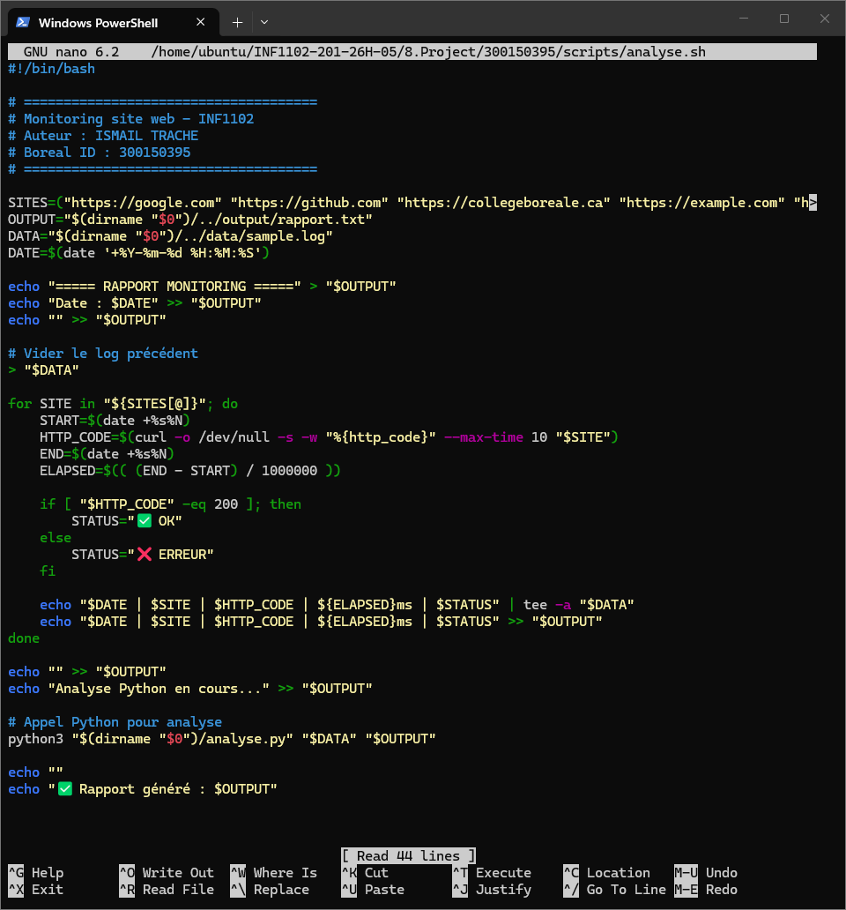
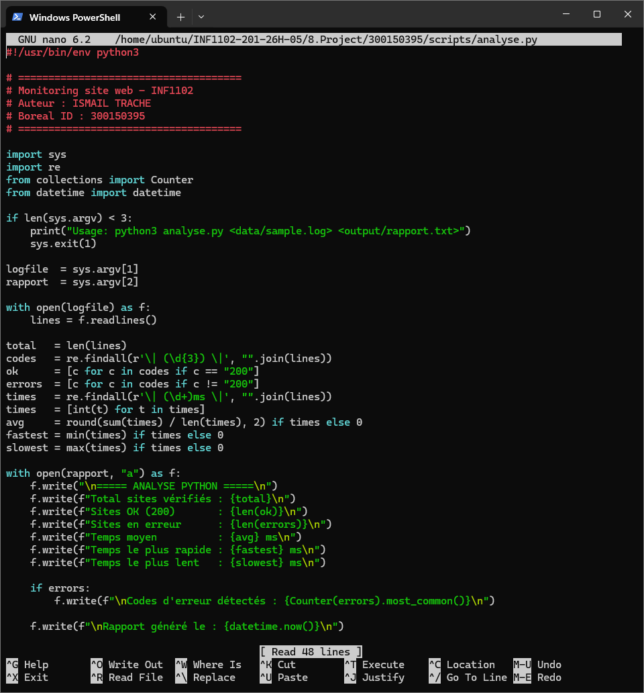
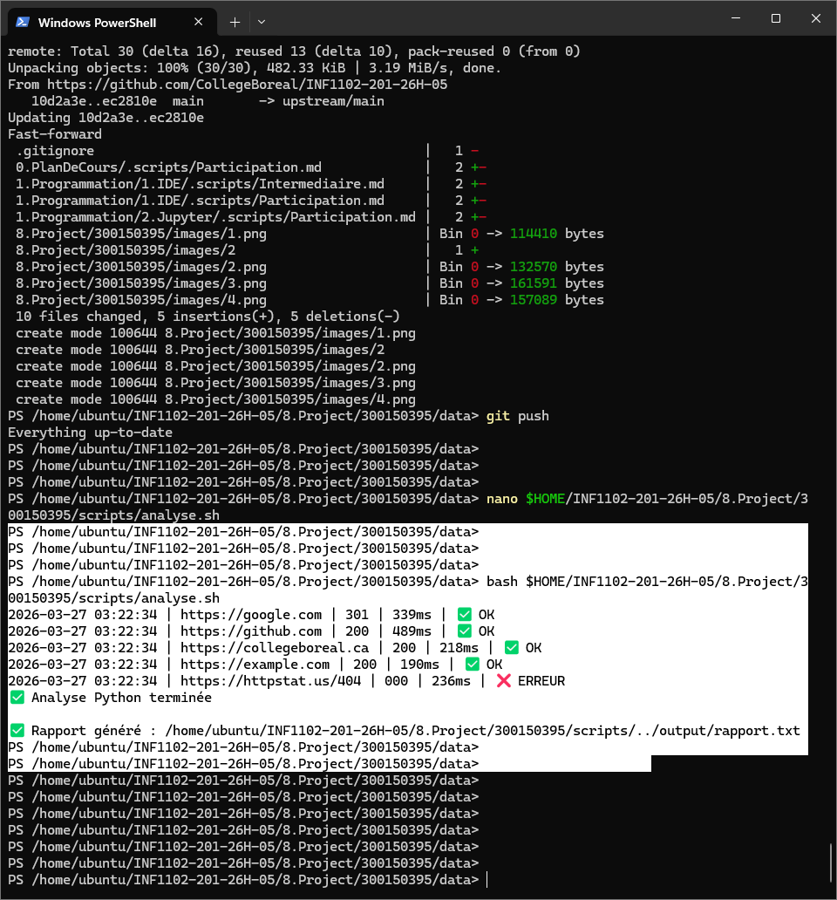
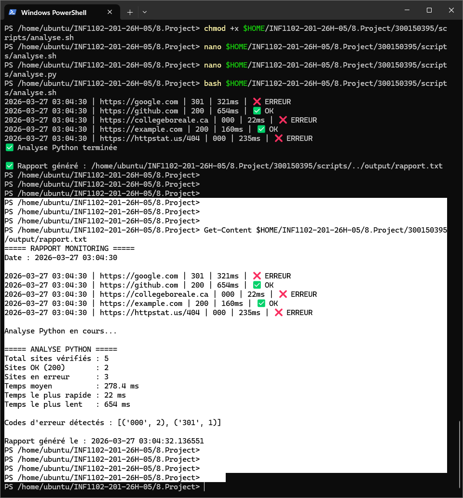

# Projet 5 — Monitoring de sites web

**Nom :** Ismail Trache
**Boréal ID :** 300150395
**Cours :** INF1102
**Environnement :** Ubuntu 22.04 LTS

---

## 1. Objectif

Ce projet vérifie la **disponibilité de plusieurs sites web** et mesure leur **temps de réponse** à l'aide d'un script Bash et d'un script Python.

Il génère automatiquement :
- un fichier log (`data/sample.log`)
- un rapport texte (`output/rapport.txt`)
- une analyse statistique complète via Python

---

## 2. Structure du projet

```plaintext
300150395/
│
├── scripts/
│   ├── analyse.sh       # Script Bash principal
│   └── analyse.py       # Script Python appelé par Bash
│
├── data/
│   └── sample.log       # Log généré automatiquement
│
├── output/
│   └── rapport.txt      # Rapport généré automatiquement
│
├── RAPPORT.ipynb        # Rapport Jupyter avec analyse et graphique
├── README.md            # Ce fichier
└── images/
    ├── 1.png            # Script analyse.sh dans nano
    ├── 2.png            # Script analyse.py dans nano
    ├── 3.png            # Exécution de bash analyse.sh
    └── 4.png            # Contenu du rapport.txt
```

---

## 3. Script Bash — analyse.sh

Le script Bash teste 5 sites avec `curl`, mesure le temps de réponse et génère le log.



Sites testés :
- `https://google.com`
- `https://github.com`
- `https://collegeboreale.ca`
- `https://example.com`
- `https://httpstat.us/404`

---

## 4. Script Python — analyse.py

Le script Python lit `data/sample.log` et génère les statistiques avec des **expressions régulières**.



Regex utilisées :
- Codes HTTP : `\| (\d{3}) \|`
- Temps de réponse : `\| (\d+)ms \|`

---

## 5. Exécution

```bash
bash scripts/analyse.sh
```



---

## 6. Résultats obtenus

```
===== RAPPORT MONITORING =====
Date : 2026-03-27 03:04:30

2026-03-27 03:04:30 | https://google.com        | 301 | 321ms | ❌ ERREUR
2026-03-27 03:04:30 | https://github.com        | 200 | 654ms | ✅ OK
2026-03-27 03:04:30 | https://collegeboreale.ca | 000 |  22ms | ❌ ERREUR
2026-03-27 03:04:30 | https://example.com       | 200 | 160ms | ✅ OK
2026-03-27 03:04:30 | https://httpstat.us/404   | 000 | 235ms | ❌ ERREUR

===== ANALYSE PYTHON =====
Total sites vérifiés : 5
Sites OK (200)       : 2
Sites en erreur      : 3
Temps moyen          : 278.4 ms
Temps le plus rapide : 22 ms
Temps le plus lent   : 654 ms

Codes d'erreur détectés : [('000', 2), ('301', 1)]
```



---

## 7. Codes HTTP expliqués

| Code | Signification |
|---|---|
| `200` | Site accessible ✅ |
| `301` | Redirection permanente (comportement normal) |
| `000` | Timeout / site inaccessible depuis la VM |

> ℹ️ Les codes `000` indiquent que certains sites sont bloqués depuis le réseau de la VM, ce qui est normal en environnement cloud restreint.

---

## 8. Automatisation avec Cron

```bash
crontab -e
```

```bash
0 * * * * bash /home/ubuntu/INF1102-201-26H-05/8.Project/300150395/scripts/analyse.sh
```

---

## 9. Dépendances

- Bash
- Python >= 3.8
- `curl`
- Modules Python : `re`, `collections`, `datetime`
- Jupyter Notebook (pour RAPPORT.ipynb)
