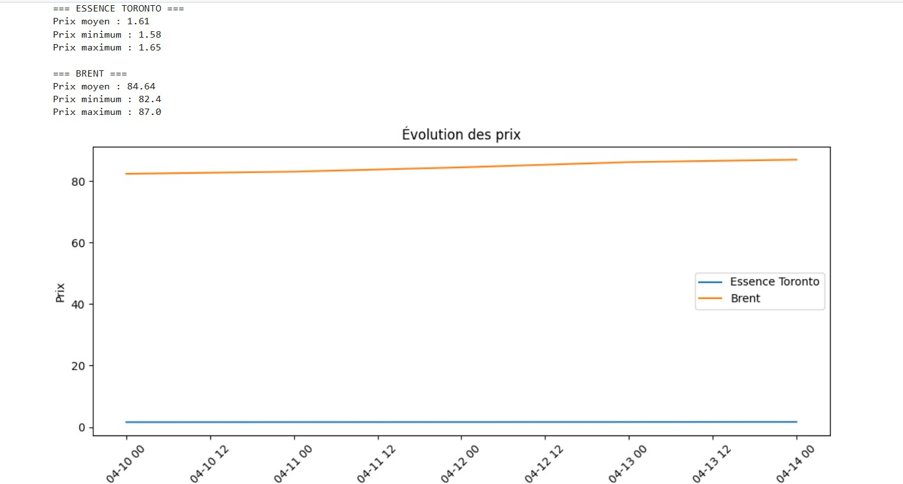
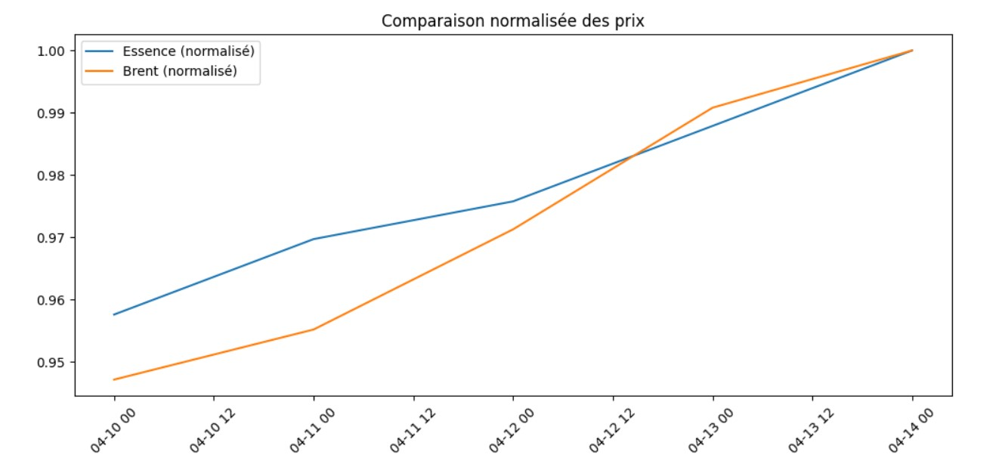
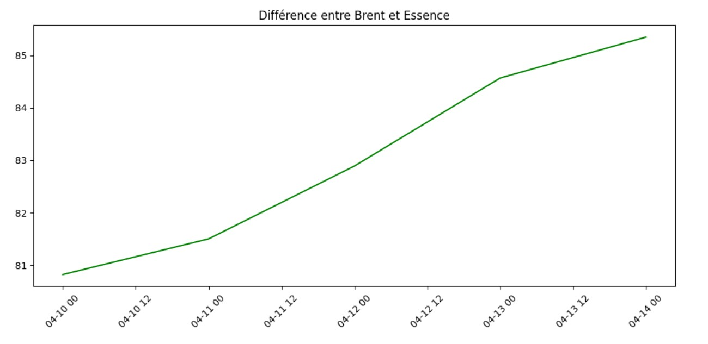

# 📊 Projet – Analyse du prix de l’essence à Toronto

## 👨‍🎓 Étudiant
- Nom : Hakim Sebai  
- Identifiant : 300151258  
- Cours : INF1102 – Programmation système  

---

## 🎯 Objectif

Ce projet vise à analyser l’évolution du prix de l’essence à Toronto en comparaison avec le prix du pétrole Brent, à partir d’un fichier de données CSV.

---

## 📁 Structure du projet

300151258/
├── data/
│   └── prix_energie.csv
├── images/
│   ├── figure1.png
│   ├── figure2.png
│   └── figure3.png
├── scripts/
│   ├── analyse.py
│   └── analyse.ps1
├── rapport.txt
├── RAPPORT.ipynb
├── README.md

---

## ⚙️ Exécution

Le script peut être exécuté avec :

powershell
python scripts/analyse.py

ou avec PowerShell :

powershell
./scripts/analyse.ps1

---

## 📊 Résultats

Le script produit :

- Moyenne, minimum et maximum des prix de l’essence à Toronto  
- Moyenne, minimum et maximum du pétrole Brent  
- Génération automatique du fichier rapport.txt

---

## 🖼️ Graphiques

### 📈 Évolution des prix

### 📊 Comparaison Essence vs Brent

### 📉 Analyse de l’écart

---

## 📌 Données

Les données utilisées proviennent du fichier :

data/prix_energie.csv

Ce fichier contient :

- date
- essence_toronto
- brent

---

## 🧠 Conclusion

Les résultats montrent que le prix de l’essence à Toronto suit globalement la tendance du prix du pétrole Brent.  
L’analyse permet de mieux comprendre la relation entre ces deux variables.

---

## ✅ Statut du projet

✔ Script Python fonctionnel  
✔ Rapport généré automatiquement  
✔ Graphiques inclus  
✔ Compatible avec le correcteur
