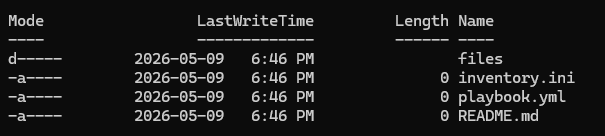
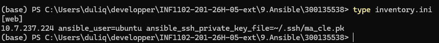
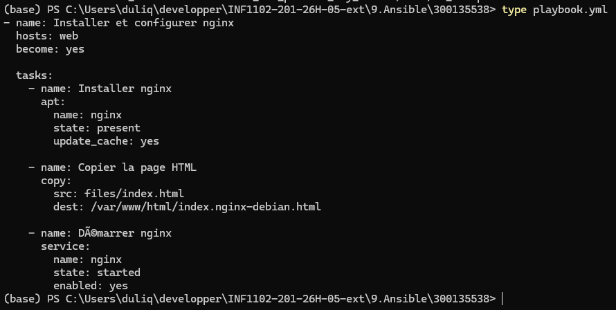
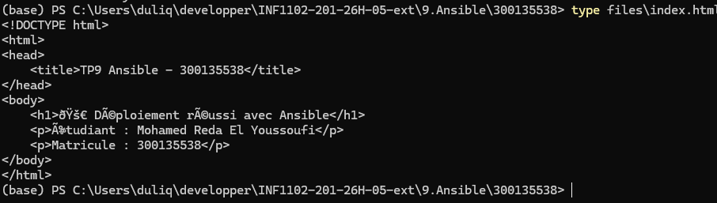

# 🧪 TP9 — Gestion de configuration avec Ansible (IaC)

## 👤 Informations étudiant

| Champ | Détails |
|---|---|
| Nom | Mohamed Reda El Youssoufi |
| Matricule | 300135538 |
| Travail | TP9 — Ansible |
| Technologies | Ansible / YAML |
| Sujet | Infrastructure as Code |

---

# 🎯 Objectifs

Ce TP permet de :

- Comprendre la gestion de configuration
- Comprendre Infrastructure as Code (IaC)
- Utiliser Ansible
- Créer un playbook YAML
- Déployer automatiquement Nginx
- Déployer une page HTML

---

# 📁 Structure du projet

```text
9.Ansible/
└── 300135538/
    ├── README.md
    ├── inventory.ini
    ├── playbook.yml
    ├── files/
    │   └── index.html
    └── images/
        ├── structure.png
        ├── inventory.png
        ├── playbook.png
        └── html.png
```

---

# ⚙️ Inventory Ansible

## Fichier : `inventory.ini`

```ini
[web]
10.7.237.224 ansible_user=ubuntu
```

---

# 📜 Playbook YAML

## Fichier : `playbook.yml`

```yaml
- name: Installer et configurer nginx
  hosts: web
  become: yes

  tasks:

    - name: Installer nginx
      apt:
        name: nginx
        state: present
        update_cache: yes

    - name: Copier la page HTML
      copy:
        src: files/index.html
        dest: /var/www/html/index.nginx-debian.html

    - name: Démarrer nginx
      service:
        name: nginx
        state: started
        enabled: yes
```

---

# 🌐 Page HTML

## Fichier : `files/index.html`

```html
<!DOCTYPE html>
<html>
<head>
    <title>TP9 Ansible - 300135538</title>
</head>
<body>

    <h1>🚀 Déploiement réussi avec Ansible</h1>

    <p>Étudiant : Mohamed Reda El Youssoufi</p>

    <p>Matricule : 300135538</p>

</body>
</html>
```

---

# 📸 Captures d’écran

## Structure du projet



---

## Inventory Ansible



---

## Playbook YAML



---

## Page HTML



---

# ☁️ Infrastructure as Code (IaC)

## Définition

Infrastructure as Code signifie :

gérer l’infrastructure avec du code plutôt qu’avec des configurations manuelles.

---

# ⚖️ Ansible vs Script classique

| Bash/Python | Ansible |
|---|---|
| Impératif | Déclaratif |
| Étapes manuelles | État désiré |
| Peu idempotent | Idempotent |
| Plus complexe | Plus lisible |

---

# 🧠 Questions théoriques

## Pourquoi Ansible est-il idempotent ?

Ansible applique uniquement les changements nécessaires.

Si le système est déjà configuré correctement,
aucune modification inutile n’est effectuée.

---

## Différence entre `present` et `started`

| État | Description |
|---|---|
| `present` | Le paquet doit être installé |
| `started` | Le service doit être démarré |

---

## Pourquoi utiliser `become: yes` ?

`become: yes` permet d’exécuter les tâches avec les privilèges administrateur (sudo).

Cela est nécessaire pour :

- installer des paquets
- modifier les services Linux
- gérer les fichiers système

---

# ✅ Résultat

Le TP a permis :

- ✔ Utilisation d’Ansible
- ✔ Création d’un playbook YAML
- ✔ Déploiement automatisé
- ✔ Gestion de configuration
- ✔ Compréhension du IaC
- ✔ Déploiement d’une page HTML

---

# 📚 Concepts appris

- YAML
- Inventory
- Playbook
- SSH
- Infrastructure as Code
- Configuration Management
- Nginx
- Déploiement automatisé

---

# 🔥 Conclusion

Ansible permet de simplifier énormément
l’administration système moderne grâce à une approche déclarative et automatisée.

Il constitue un outil majeur dans le domaine DevOps et Infrastructure as Code.