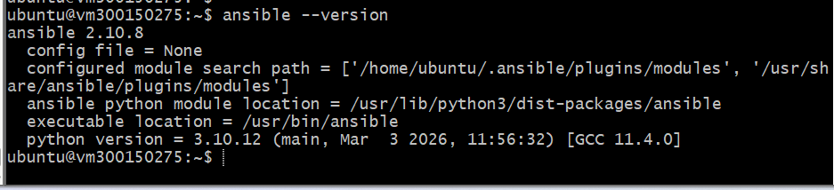
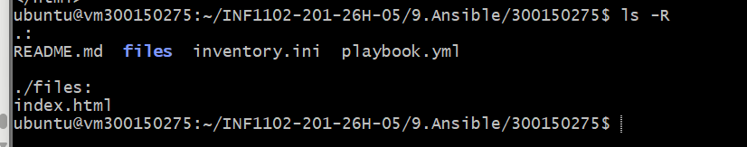
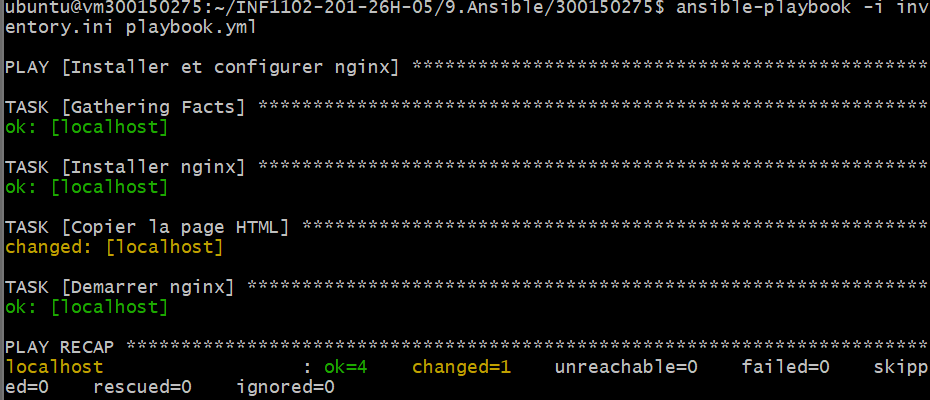
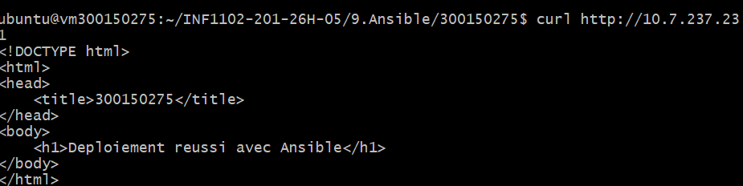

<div align="center">

```
 █████╗ ███╗   ██╗███████╗██╗██████╗ ██╗     ███████╗
██╔══██╗████╗  ██║██╔════╝██║██╔══██╗██║     ██╔════╝
███████║██╔██╗ ██║███████╗██║██████╔╝██║     █████╗  
██╔══██║██║╚██╗██║╚════██║██║██╔══██╗██║     ██╔══╝  
██║  ██║██║ ╚████║███████║██║██████╔╝███████╗███████╗
╚═╝  ╚═╝╚═╝  ╚═══╝╚══════╝╚═╝╚═════╝ ╚══════╝╚══════╝
```

### ⚡ Infrastructure as Code · Déploiement automatisé · Nginx

<br/>

[](.)
[](.)
[](.)

<br/>

[](.)
[](.)
[](.)
[](.)
[](.)

</div>

---

<div align="center">
<h2>🗺️ Table des matières</h2>

[Objectif](#-objectif) · [Structure](#-structure-du-projet) · [Configuration](#-configuration) · [Étapes](#-étapes-de-réalisation) · [Questions](#-questions-théoriques) · [Résultat](#-résultat)

</div>

---

## 🎯 Objectif

> **Déployer automatiquement un serveur Nginx sur une VM Ubuntu en utilisant Ansible comme outil IaC.**

Ce TP démontre la puissance de l'approche **déclarative** : on décrit *ce que l'on veut*, et Ansible s'occupe du *comment*.

```
🖥️  Machine de contrôle (VM)
        │
        │  ansible-playbook
        ▼
🌐  Serveur Nginx → Page HTML accessible sur http://10.7.237.231
```

---

## 📁 Structure du projet

```
300150275/
│
├── 📄 inventory.ini          ← Définit la machine cible
├── 📄 playbook.yml           ← Tâches d'automatisation YAML
├── 📄 README.md              ← Documentation (vous êtes ici)
│
├── 📂 files/
│   └── 🌐 index.html         ← Page web déployée par Ansible
│
└── 📂 images/
    ├── 🖼️  ansible-version.png
    ├── 🖼️  structure-fichiers.png
    ├── 🖼️  playbook-execution.png
    └── 🖼️  curl-verification.png
```

---

## ⚙️ Configuration

<details>
<summary><b>📄 inventory.ini — Cliquez pour voir</b></summary>

```ini
[web]
localhost ansible_connection=local
```

> 💡 Ansible s'exécutant directement **sur la VM**, on utilise `ansible_connection=local` pour éviter une connexion SSH inutile.

</details>

<details>
<summary><b>📄 playbook.yml — Cliquez pour voir</b></summary>

```yaml
- name: Installer et configurer nginx
  hosts: web
  become: yes

  tasks:

    - name: Installer nginx
      apt:
        name: nginx
        state: present
        update_cache: yes

    - name: Copier la page HTML
      copy:
        src: files/index.html
        dest: /var/www/html/index.nginx-debian.html

    - name: Démarrer nginx
      service:
        name: nginx
        state: started
        enabled: yes
```

</details>

<details>
<summary><b>🌐 files/index.html — Cliquez pour voir</b></summary>

```html
<!DOCTYPE html>
<html>
<head>
    <title>300150275</title>
</head>
<body>
    <h1>Deploiement reussi avec Ansible</h1>
</body>
</html>
```

</details>

---

## 🛠️ Étapes de réalisation

### `ÉTAPE 1` · Installation d'Ansible

```bash
sudo apt update && sudo apt install -y ansible
ansible --version
```



---

### `ÉTAPE 2` · Création de la structure

```bash
mkdir -p 300150275/files 300150275/images
touch 300150275/inventory.ini
touch 300150275/playbook.yml
touch 300150275/files/index.html
```



---

### `ÉTAPE 3` · Exécution du Playbook

```bash
ansible-playbook -i inventory.ini playbook.yml
```



| Métrique | Valeur |
|----------|--------|
| ✅ `ok` | 4 |
| 🔄 `changed` | 1 |
| ❌ `unreachable` | 0 |
| 💥 `failed` | 0 |

---

### `ÉTAPE 4` · Vérification finale

```bash
curl http://10.7.237.231
```



---

## 🧠 Questions théoriques

<details>
<summary><b>❓ Pourquoi Ansible est-il idempotent ?</b></summary>

Ansible **vérifie l'état actuel** du système avant d'agir. Si Nginx est déjà installé, il ne le réinstalle pas. On peut relancer le playbook autant de fois qu'on veut : le résultat sera toujours identique.

</details>

<details>
<summary><b>❓ Différence entre <code>present</code> et <code>started</code> ?</b></summary>

| Mot-clé | Cible | Action |
|---------|-------|--------|
| `present` | **Paquet** | S'assure qu'il est installé |
| `started` | **Service** | S'assure qu'il est en cours d'exécution |

</details>

<details>
<summary><b>❓ Pourquoi <code>become: yes</code> ?</b></summary>

`become: yes` élève les privilèges en **mode sudo**, nécessaire pour :
- 📦 Installer des paquets avec `apt`
- 📂 Écrire dans `/var/www/html/`
- ⚙️ Gérer des services système comme Nginx

</details>

---

## ⚠️ Difficultés rencontrées

| # | Problème | Solution appliquée |
|---|----------|--------------------|
| 1 | Clé SSH introuvable sur la VM | `ansible_connection=local` |
| 2 | Mauvaise IP dans `inventory.ini` | Correction → `10.7.237.231` |
| 3 | Répertoire `9.Ansible` absent | `mkdir 9.Ansible` |
| 4 | Conflit Git lors du `pull` | `git stash` puis `git pull` |

---

## ✅ Résultat

```
┌─────────────────────────────────────────────────┐
│                                                 │
│   ✅  Ansible installé      → v2.10.8           │
│   ✅  Nginx déployé         → actif & démarré   │
│   ✅  Page HTML accessible  → http://10.7.237.231│
│                                                 │
└─────────────────────────────────────────────────┘
```

---

## 📚 Conclusion

Ce TP m'a permis de comprendre concrètement la puissance d'**Ansible** pour automatiser la configuration d'un serveur. L'approche **déclarative** est plus fiable et reproductible qu'un script manuel. Ansible garantit un état cohérent du système à chaque exécution du playbook, ce qui en fait un outil incontournable en **DevOps** et **administration système**.

---

<div align="center">

**300150275** · INF1102-201-26H-05 · Avril 2026

</div>
