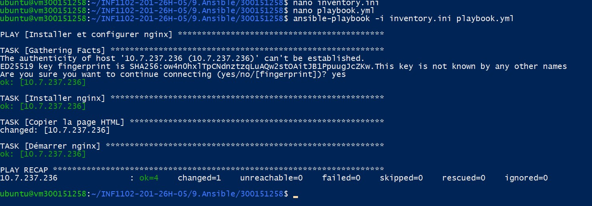

# 🟢 TP Ansible – Déploiement Nginx

**👤 Étudiant : 300151258**

---

## 🎯 Objectif

Mettre en place un déploiement automatisé avec Ansible permettant de :

- installer nginx  
- déployer une page HTML  
- démarrer et activer le service  

---

## 📁 Structure du projet

```
300151258/
├── inventory.ini
├── playbook.yml
├── files/
│   └── index.html
└── images/
    └── 1.png
```

---

## ⚙️ Configuration

### 📄 inventory.ini

```ini
[web]
10.7.237.236 ansible_user=ubuntu ansible_ssh_private_key_file=~/.ssh/ma_cle.pk
```

---

### 📄 playbook.yml

```yaml
- name: Installer et configurer nginx
  hosts: web
  become: yes

  tasks:
    - name: Installer nginx
      apt:
        name: nginx
        state: present
        update_cache: yes

    - name: Copier la page HTML
      copy:
        src: files/index.html
        dest: /var/www/html/index.nginx-debian.html

    - name: Démarrer nginx
      service:
        name: nginx
        state: started
        enabled: yes
```

---

## 🌐 Page HTML

```html
<h1>🚀 Déploiement réussi avec Ansible</h1>
```

---

## ▶️ Exécution

```bash
ansible-playbook -i inventory.ini playbook.yml
```

---

## 🧪 Vérification

```bash
curl http://10.7.237.236/index.nginx-debian.html
```

---

## 📸 Capture



---

## 🧠 Réponses

### 1. Pourquoi Ansible est idempotent ?

Ansible applique l’état souhaité sans répéter une action déjà effectuée.

---

### 2. Différence entre `present` et `started` ?

- `present` → le paquet est installé  
- `started` → le service est démarré  

---

### 3. Pourquoi utiliser `become: yes` ?

Permet d’exécuter les tâches avec des privilèges administrateur (sudo).

---

## 🚀 Conclusion

Ce TP montre comment utiliser Ansible pour automatiser la configuration d’un serveur web avec nginx de manière fiable, reproductible et déclarative.
